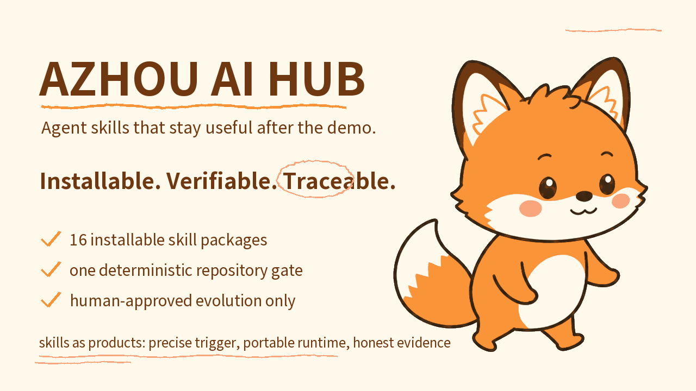
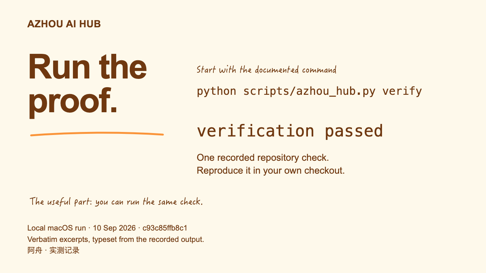
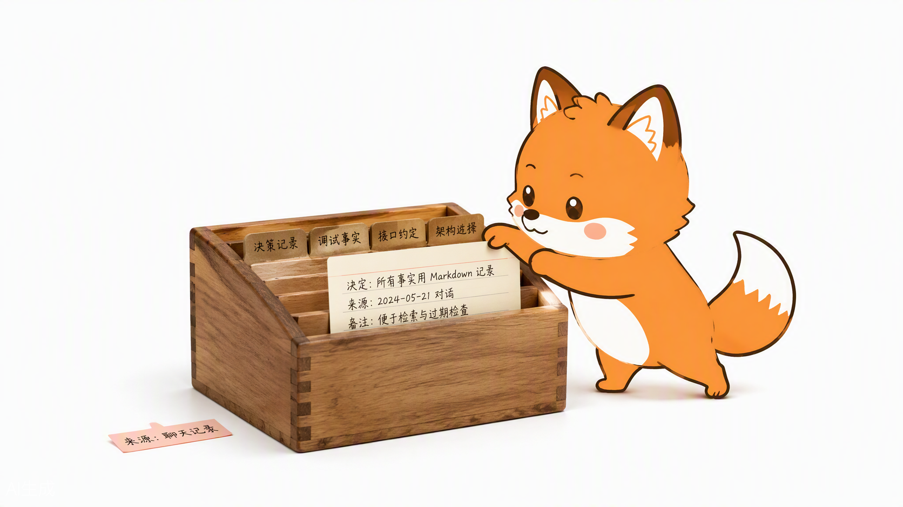

# 🦊 Azhou AI Hub · 阿舟 AI 能力站

**不止能演示，更要经得起真实任务。**

足够小，可以改；足够严，可以验；足够中立，可以跨 Agent harness 使用。

[English](README.md) · [安装](docs/installation.md) · [支持矩阵](docs/support-matrix.md) · [参与贡献](CONTRIBUTING.md)

> 🦊 主视觉由 Azhou Covers skill 按 `github_readme_image_16_9` profile 确定性合成：米色纸面、注册四色、canonical 角色按原像素合成。120/240/360 px 缩略图复核已通过；最终公开视觉批准仍保留为人工 checkpoint。

很多 skill 仓库停在提示词。Azhou AI Hub 把每个 skill 当成产品：触发准确、运行包可移植、依赖可复现、检查可执行、评测不造假、来源可追踪、演化受人类控制。

这里不做接管一切的通用框架，不为每个模型复制一份 skill，也不把 benchmark 答案藏进运行包。

## 安装路径

每条命令安装一个包：

~~~bash
npx skills add TeFuirnever/azhou-ai-hub --skill super-repo-pedant
npx skills add TeFuirnever/azhou-ai-hub --skill excalidraw-diagram
npx skills add TeFuirnever/azhou-ai-hub --skill azhou-info
npx skills add TeFuirnever/azhou-ai-hub --skill azhou-doctor
npx skills add TeFuirnever/azhou-ai-hub --skill azhou-setup
npx skills add TeFuirnever/azhou-ai-hub --skill azhou-verify
npx skills add TeFuirnever/azhou-ai-hub --skill super-caveman
npx skills add TeFuirnever/azhou-ai-hub --skill super-llm-wiki
npx skills add TeFuirnever/azhou-ai-hub --skill super-lavish
npx skills add TeFuirnever/azhou-ai-hub --skill eli5
npx skills add TeFuirnever/azhou-ai-hub --skill ask-azhou
npx skills add TeFuirnever/azhou-ai-hub --skill autoresearch
npx skills add TeFuirnever/azhou-ai-hub --skill arch-doc
npx skills add TeFuirnever/azhou-ai-hub --skill session-insights
~~~

以上是文档化的包管理器路径；完成时间和 harness 发现能力取决于宿主，这里不承诺固定秒数。

只选一种安装方式。同一 canonical name 下，不要叠加包管理器安装、checkout 托管安装、手工复制和开发软链接。四个 `azhou-*` 包负责让 harness 发现对应的 `SKILL.md` 工作流；它们不内置 Foundation CLI，仍需要显式本地 checkout。完整安装路径和依赖见[安装指南](docs/installation.md)。

## 检查、配置或验证当前 checkout

四个可移植阿舟 Agent Skills 提供 checkout 工作流入口，但不复制执行逻辑。通过当前 harness 原生的 Skill 入口调用它们，并在 Azhou AI Hub checkout 中运行，或显式提供 checkout 路径。每个适配器都委派给该 checkout 的零依赖 Foundation CLI：

| Agent Skill | CLI 权威命令 | 修改边界 |
|---|---|---|
| `azhou-info` | `info`、`version` | 只读报告项目、运行时、Git revision 和 dirty state。 |
| `azhou-doctor` | `doctor` | 只读诊断仓库、显式安装 target 和可选 Treehouse lease。 |
| `azhou-setup` | `setup`、`repair`、`migrate`、`uninstall` | 先 dry-run；只有经过核对的精确计划带 `--apply` 才能修改显式 target。 |
| `azhou-verify` | `verify` | 运行可公开复现的仓库完整性 gate；维护者可显式追加 promotion evidence 回放。 |

~~~bash
python scripts/azhou_hub.py info --json
python scripts/azhou_hub.py version --json
python scripts/azhou_hub.py doctor --json
python scripts/azhou_hub.py setup --skill super-repo-pedant --target /absolute/path/to/harness/skills --json
python scripts/azhou_hub.py verify
~~~

`setup`、`repair`、`migrate` 和 `uninstall` 在出现 `--apply` 前保持只读。Setup 可重复收敛，遇到不同安装会拒绝覆盖。Receipt-owned 生命周期命令要求再次提供同一显式 target，并独立校验 canonical source 与安装身份；不会强制覆盖 drift、跨 harness root 迁移、安装 hook、重写宿主配置、访问 registry 或自更新。各 harness 共用同一批包，但发现、调用、权限和可选集成仍由宿主负责；完整边界见[支持矩阵](docs/support-matrix.md)与[基础 CLI 合同](docs/foundations.md)。

Setup 的 dry-run 会输出确定性的 `planId`；审核后必须使用 `--apply --plan-id <reviewed-planId>`，源、目标、模式或执行前状态发生变化都会拒绝执行。

## Skills

| Skill | 解决的真实任务 | 验证依据 |
|---|---|---|
| [Azhou Info](skills/azhou-info/SKILL.md) | 报告 checkout、运行时、支持范围和可证明的 Git revision，不虚构发布状态。 | 委派给稳定的 `info` / `version` JSON 合同；只读包检查与仓库策略检查。 |
| [Azhou Doctor](skills/azhou-doctor/SKILL.md) | 只读诊断仓库、显式安装 target 和可选 Treehouse lease。 | 只读 doctor 合同、真实 Treehouse 2.3.0 smoke 和 fail-closed target 检查。 |
| [Azhou Setup](skills/azhou-setup/SKILL.md) | 先规划再显式执行 checkout-assisted 安装或 receipt-owned 生命周期操作。 | dry-run-first setup、mutation lock、身份防护、rollback 与 receipt 回归。 |
| [Azhou Verify](skills/azhou-verify/SKILL.md) | 执行公开全仓完整性 gate，或显式执行维护者 promotion 回放。 | 委派给仓库策略、单元测试、benchmark integrity 和空白检查；promotion 模式额外要求 Git-external 证据。 |
| [Super Repo Pedant](skills/super-repo-pedant/SKILL.md) | 明确任务结束时，用当前代码校正文档、项目规则、交接状态和已绑定项目 memory。 | 28/28 项 <code>neat-freak</code> 能力有机器映射；3 个注册行为 case；固定执行协议与 memory inventory 证明。 |
| [Excalidraw Diagram](skills/excalidraw-diagram/SKILL.md) | 生成或编辑可继续修改的图，渲染真实产物、查看成图，并按需交付 CJK-safe SVG/PNG。 | 5 个冻结 benchmark case；风格、场景、重叠和 same-DOM 确定性 gate。仓库 reference 只证明接线，不冒充模型效果。 |
| [Super LLM Wiki](skills/super-llm-wiki/SKILL.md) | 构建私有、持久的 Markdown 项目知识库，让 Agent 跨会话摄取、检索、读取和检查知识。 | 标准本地目录、8 个 MCP 工具与决策生命周期、原子迁移、隐私默认值和专项确定性合同测试。 |
| [Super Caveman](skills/super-caveman/SKILL.md) | 在原版 Caveman 上完整采用锁定版 `i-have-adhd` 输出行为，并吸纳 commit、review、委派、帮助、文件压缩和统计路线。 | 原版 Caveman 加六个伴生 Skill，收口为一个 canonical 包；8 条路线、保留的 14-case 历史证据、当前 19/19 case 与 44/44 criterion 行为运行、三名独立配对评审 3/3 选择 candidate 且高风险回归为 0，以及可恢复压缩门禁。证据仅适用于记录的 Codex Desktop 宿主/模型。 |
| [Super Lavish](skills/super-lavish/SKILL.md) | 把复杂或视觉化的 Agent 回复变成富 HTML 产物，用户可以标注、排队 prompt 并通过 Lavish Editor CLI 反馈；Spec Relay relay 模式把 PRD、RFC、设计或技术 Spec 连同评论、选区批注、处置与下一责任人状态打包进一份可传递 HTML。 | 上游基线哈希锁定用于复现，CLI 锁定 <code>0.1.47</code>，本地层在其上加入 relay 模式；provenance 记录不可变上游 commit 与可复现源校验。relay 模式内嵌 <code>spec-relay.html-state.v1</code> 与乐观修订守卫；确定性检查覆盖反馈更新、旧副本拒绝、可见状态精确投影与响应式布局。本地审阅不是发布；<code>share</code> 需要单独授权。不主张 hosted-share receipt。 |
| [Eli5](skills/eli5/SKILL.md) | 像讲给完全零基础的人一样解释主题：交付一份自带全部内容、大图少字的独立 HTML，遇到精度关键的请求会显式拒绝，不把精读内容降级成图片。 | 上游行为句在锁定上游 commit 上逐字保留，并有可复现的 SHA-256 源校验；本地层增加主题边界、自包含产物合同、品牌协议和稳定收据，并有确定性包面检查覆盖。尚无行为 benchmark。 |
| [Ask Azhou](skills/ask-azhou/SKILL.md) | 全目录路由：说清意图，得到技能、模式与边界。只推荐不代调用；路由覆盖由仓库门禁强制。 | 路由模式改编自锁定上游；路由图奇偶校验是带负控的仓库门禁检查。尚无行为 benchmark。 |
| [Autoresearch](skills/autoresearch/SKILL.md) | 包装用户自有、锁定 commit 的 karpathy/autoresearch checkout，让 Agent 能准备、运行、恢复和汇报自动 nanochat 训练实验，无人值守 GPU 运行前先显式 hold。 | 阿舟自研包装器；上游未发布 license，因此不 vendor 任何上游字节；setup 对 GPU、uv 和 pin 检查 fail-closed，并有确定性包面检查覆盖。尚无行为 benchmark。 |
| [Arch Doc](skills/arch-doc/SKILL.md) | 从上游真源文档端到端产出、校准与评审架构设计文档：带出处的研究笔记、受控证据词表的基线骨架、PlantUML 唯一图纪律（四联注与时序图规范）、回源交叉校准和两条最佳实践评审线。 | 沉淀自 MCC ARCH-2026-001 v0.1–v0.17 流水线（团队上游研读、可读性审计、最佳实践评审与 architect 批准的 20 项改进）；五张已验证时序图与两份评审指南作为 references 随包交付；附确定性脚手架（`new_doc.py`）、收尾门检查器（`verify_doc.py`）与 `benchmarks/arch-doc/` 黄金用例。 |
| [Session Insights](skills/session-insights/SKILL.md) | 从本机 agent 会话存储产出事实绑定的使用洞察报告（Claude Code 与 Codex 适配器；zcode 适配器 fail closed——探测确认其存储无明文转写）；只做聚合，原始转写永不出本机。 | 合成存储上的接线完整性套件：golden 聚合、窗口/上限裁剪、收据摘要稳定性、隐私与 fail-closed 负控。不含摘录的聚合运行复用可丢弃的逐文件元数据缓存，冷、热、删除、损坏四种缓存状态产出字节一致的结果；roast 语气、离线 HTML 产物与 Codex rollout 适配器均在 golden parity 与 fail-closed 负控之下交付，zcode hold 即使面对更丰富但未核实的存储形状也保持不动。尚无行为 benchmark。 |

十四个包都能作为独立 package surface 安装和发现。目录按[技能标准](docs/skill-standard.md) §2.2 的调用类轴组合：[Ask Azhou](skills/ask-azhou/SKILL.md) 是 user-invoked 前门，每个包都声明调用类——十三个在各自 `SKILL.md` frontmatter（user-invoked orchestrator 或双类面），super-caveman 的在仓库门禁的持表声明中直至其晋升冻结树下次 ride——orchestrator 可以指向 discipline，任何东西不得链入另一个 orchestrator，但这不代表四个 Foundation 适配器是独立控制面：它们仍需要显式本地 checkout，并编排该 checkout 的仓库级 CLI，而不是在 prompt 中复制生命周期逻辑。运行时材料在 <code>skills/</code>；prompt、assertion、fixture 和 judge record 在仓库级 <code>benchmarks/</code>。

Canonical 名字本身携带来源信息：`super-` 前缀表示该 skill 改编自锁定上游材料，无前缀表示原创或忠实承接。仓库门禁双向强制执行这条 prefix-fidelity 规则，并对已改名旧名字在文档兼容面之外的残留直接 fail。

## 试用六个任务型 Skill

| Skill | 复制给 Agent | 必须返回什么 |
|---|---|---|
| Super Repo Pedant | <code>这个阶段做完了，跑一次 super-repo-pedant reconcile。</code> | 已对齐的知识面、具名检查、明确 hold 和稳定收据。[运行 demo](docs/demos/super-repo-pedant.md)。 |
| Excalidraw Diagram | <code>用 excalidraw-diagram 画登录时序图，交付可编辑源图和 PNG。</code> | 可编辑 <code>.excalidraw</code>、真实渲染/导出、确定性 gate、视觉复核状态和稳定收据。[运行 demo](docs/demos/excalidraw-diagram.md)。 |
| Super Caveman | <code>使用 /super-caveman full，再为这份 diff 写 commit message。</code> | 行动优先精简模式和可直接粘贴的 Conventional Commit；不暂存、不提交。 |
| Super LLM Wiki | <code>用 super-llm-wiki 保存这条已验证的架构决策，再检索回来并检查 wiki。</code> | 私有本地页面、来源与置信度、检索结果、健康报告和稳定收据。[运行 demo](docs/demos/super-llm-wiki.md)。 |
| Super Lavish | <code>用 super-lavish 的 relay 模式把这份 Spec 和审阅评论打包成一份可传递 HTML。</code> | 与来源关联的 HTML、可寻址分区、内嵌评论与批注、已处置反馈、未决责任人、明确的 transport/publication 状态和 relay 收据。[运行 demo](docs/demos/super-lavish.md)。 |
| Arch Doc | <code>用 arch-doc 从这个仓库的上游设计文档产出架构说明书。</code> | 带出处的研究笔记、图注入账的模板骨架、仅 PlantUML 的图纪律、确定性收尾门禁和稳定收据。[运行 demo](docs/demos/arch-doc.md)。 |

Demo 严格区分产品行为与 benchmark 主张：合成 fixture 只证明合同和 verifier 接线，只有冻结的 attempt-1 运行才算模型证据。

## 为什么可信

- **现役行为优先。** 代码、机器配置和真实运行证据定义 current truth；未实现 spec 保留为 reminder。
- **主张必须有 gate。** 仓库权威 gate 执行完整确定性测试套件、4-case Super Repo Pedant 套件、8-route 加 19-response-case Super Caveman 完整性套件、5-case Excalidraw benchmark 完整性检查、Session Insights 合成会话存储接线完整性套件、JSON/链接/来源/凭据策略和空白检查。
- **不伪装跨平台完全等价。** Codex、Claude Code、zcode 共用运行包，但 hook 与历史适配能力在[支持矩阵](docs/support-matrix.md)中分开写。
- **历史不能静默改 live skill。** promotion 必须先有回归，再通过确定性检查、paired 多数、无安全回归和 exact-diff 人类批准。
- **来源边界公开。** 上游快照、vendored 资产和未授权 prior art 的排除记录见[第三方声明](THIRD_PARTY_NOTICES.md)。

## Super Repo Pedant

> 🧹 代码是唯一现役答案，其他都要对齐。

任务确实结束时显式调用：

~~~text
这个阶段做完了，跑一次 super-repo-pedant reconcile。
~~~

只推测 milestone 时，skill 只提醒一次，不静默写仓库。明确 reconcile/handoff 默认覆盖三层项目知识：用户文档、<code>AGENTS.md</code>/<code>CLAUDE.md</code>、已证明属于当前项目的 memory。全局指令、归属不明 memory、整文件删除、发布和部署继续保留 checkpoint。

[兼容合同](skills/super-repo-pedant/references/neat-freak-compatibility.md) · [执行协议](skills/super-repo-pedant/references/execution-protocol.md)

> 🦊 效果图由 Azhou Scenes skill 生成。机器颜色门禁已通过；身份、手部和文字仍保留人工复核 checkpoint。

## Excalidraw Diagram

> ✏️ 先让结构讲清关系，再让文字补充证据。

JSON 可解析不等于完成。这个 skill 要求交付可编辑源图，用官方引擎渲染，实际查看图片，从源场景修复，再重跑 gate。离线字体、官方引擎、转换器和 231 个 MIT 许可的组件库随运行包提供。

> ✏️ 效果图由 Azhou Scenes skill 生成。机器颜色门禁已通过；身份、手部和文字仍保留人工复核 checkpoint。

[运行包](skills/excalidraw-diagram/SKILL.md) · [依赖安装](skills/excalidraw-diagram/references/setup.md) · [来源说明](skills/excalidraw-diagram/references/provenance.md)

## Super Caveman

> 🪨 少说话，技术信号不丢。

Super Caveman 保留原版 Caveman 的持续精简模式作为核心，把六个伴生 Skill 吸纳为紧凑委派、commit message、review、受保护文本压缩、帮助和证据约束统计路线，并完整采用锁定版 `i-have-adhd` 的输出行为合同。全部能力只通过一个 canonical `super-caveman` 包交付。安全与显式输出合同优先，完整 ADHD-friendly 行为合同其次，Caveman 压缩最后。插件安装、hook、全局配置、诊断主张和未经验证的跨会话持久化不进入这个中立包。可选的 Codex、Claude Code 与 zcode 生命周期适配器是文档记录的例外，必须在显式 scoped setup 之后才会注册任何 hook。文件压缩不会启动第二个模型，也不会静默外传内容；标准库门禁会检查源文件、验证受保护结构、写入仓库外备份、使用检查点式不覆盖安装，并拒绝覆盖更新后的文件。受保护 apply/restore 要求文件系统支持同目录 hard link；不支持时会在移动源文件前阻断。关键操作每个已验证阶段只使用一个克制的阿舟锚点；普通精简回复不添加生命周期 emoji。宿主没有可审计计数器时，精确统计明确返回不可用。

> 🦊 效果图由 Azhou Scenes skill 生成。构图、文字和运行绑定已检查；正式 v1.9 色彩转正与最终身份/手部批准仍保留 checkpoint。

[运行包](skills/super-caveman/SKILL.md) · [依赖安装](skills/super-caveman/references/setup.md) · [来源说明](skills/super-caveman/references/provenance.md) · [压缩安全流程](skills/super-caveman/references/compression.md)

## Super LLM Wiki

> 📚 知识要留得住，也要经得起查证。

Super LLM Wiki 只把 Markdown 页面保存在 `<project>/.azhou/super-llm-wiki/`，维护自动索引和操作日志，并提供确定性的关键词、标签、CJK 检索与健康检查。CLI、8 工具 stdio MCP、生命周期事件、项目上下文和迁移共用同一 Python 核心。其他目录必须先 dry-run 再原子复制，源数据保留，会话采集重置为关闭。配置只生成供人工审核，不会静默安装。

> 🦊 效果图来自同一隔离项目的真实 CLI、MCP `tools/list` 与 `SessionStart` 运行。证据包、渲染和实际看图检查已通过；最终公开视觉批准仍保留为人工 checkpoint。

[运行 demo](docs/demos/super-llm-wiki.md) · [运行包](skills/super-llm-wiki/SKILL.md) · [品牌协议](skills/super-llm-wiki/references/brand-layer.md) · [生产设计](skills/super-llm-wiki/references/design.md) · [依赖安装](skills/super-llm-wiki/references/setup.md) · [来源说明](skills/super-llm-wiki/references/provenance.md)

## Lavish Editor

> 🪄 HTML 本身就是交接包。

Lavish Editor 是通用富 HTML 审阅面：artifact 模式服务复杂或视觉化回复，阿舟维护的 Spec Relay relay 模式服务 Spec 交接。两者共用上游浏览器审阅、专用 playbook、Mermaid/Excalidraw 可编辑审阅、单文件导出和可选分享。阿舟只出现在 Agent 进度锚点与收据中；可传递 HTML 不会被 Skill 注入阿舟身份、emoji、角色资产或配色。relay 模式把完整评论、选中文字批注、定位目标、处置状态和责任人写入 HTML-safe 的 <code>spec-relay.html-state.v1</code>。审阅者可以在保留原记录的同时改判反馈并把交接包移交下一责任人；状态修订号会拒绝旧副本静默覆盖。响应式可见台账必须与内嵌状态精确一致，同一份文件即可把 Spec 和审阅历史传给下一位队友或 Agent。本地审阅不等于发布；<code>share</code> 仍需单独授权，并会一并传递内嵌评论。

[运行包](skills/super-lavish/SKILL.md) · [Relay 协议](skills/super-lavish/references/spec-relay.md) · [依赖安装](skills/super-lavish/references/setup.md) · [来源说明](skills/super-lavish/references/provenance.md) · [上游兼容映射](skills/super-lavish/references/upstream-compatibility.md)

## 一套架构

~~~text
docs/skill-standard.md ── 约束 ──> skills/<name>/       可安装运行包
          │                              │
          ├── 分配 ──────────────────> .azhou/<name>/      私有运行状态
          ├── 约束 ──────────────────> tests/              确定性证明
          └── 约束 ──────────────────> benchmarks/<name>/  隔离行为证据

历史信号 ──> 隔离 candidate ──> paired review ──> 人类 promotion
                    永远不直接写 live skill
~~~

[Azhou Skill Standard](docs/skill-standard.md) 是项目唯一准则。[架构说明](docs/architecture.md)解释边界，[治理规则](GOVERNANCE.md)解释决策方式。

可安装包继续放在 `skills/`。项目内 Azhou 运行状态统一使用 `.azhou/<skill-name>/`；`.azhou/hub/` 专门保存 checkout-managed 生命周期 receipt。宿主配置、宿主缓存和用户选择的交付物都留在这个命名空间之外。

## 开发

仓库级验证只需要 Python 3.11+：

~~~bash
python scripts/verify.py
~~~

同一条命令不依赖私有输入，检查仓库策略、全部单元测试、五套公开 benchmark 完整性和 Git 空白。它在 CI 的 Ubuntu 与 windows-latest runner 上强制执行，并在维护者的 macOS checkout 上验证，因此 [docs/support-matrix.md](docs/support-matrix.md) 中的 OS 支持主张始终有据可查。Super Caveman 的公开完整性检查仍会针对当前 staged 或 committed tree 重算已批准的 exact diff，因此已批准路径一旦变化，就必须取得新的 promotion evidence，不能静默通过。发布维护者在物化 Git-external 的 Super Caveman approval/review 记录后，额外运行 `python scripts/verify.py --promotion-evidence`；该模式验证原始 promotion evidence 的真实性，默认公开 gate 只验证仓内 receipt 和 exact diff，不声称完成外部认证。Excalidraw 真渲染需要额外锁定的 Python/Node 依赖，按自己的 setup 文档安装。

## 项目入口

- [路线图](docs/roadmap.md)
- [变更记录](CHANGELOG.md)
- [安全政策](SECURITY.md)
- [支持方式](SUPPORT.md)
- [基础 CLI](docs/foundations.md)
- [Treehouse worktree 规范](docs/worktree-policy.md)
- [本次开源化对标研究](docs/research/2026-08-23-open-source-benchmark.md)

贡献应从真实失败或真实任务开始，以可复现证据结束。先读 [CONTRIBUTING.md](CONTRIBUTING.md)。

## 许可证

阿舟自研代码使用 [MIT](LICENSE)。第三方组件保留自己的版权与许可证：[THIRD_PARTY_NOTICES.md](THIRD_PARTY_NOTICES.md)。
