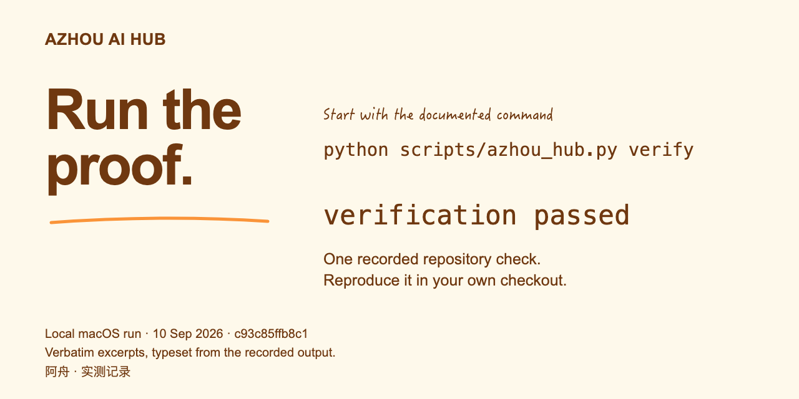
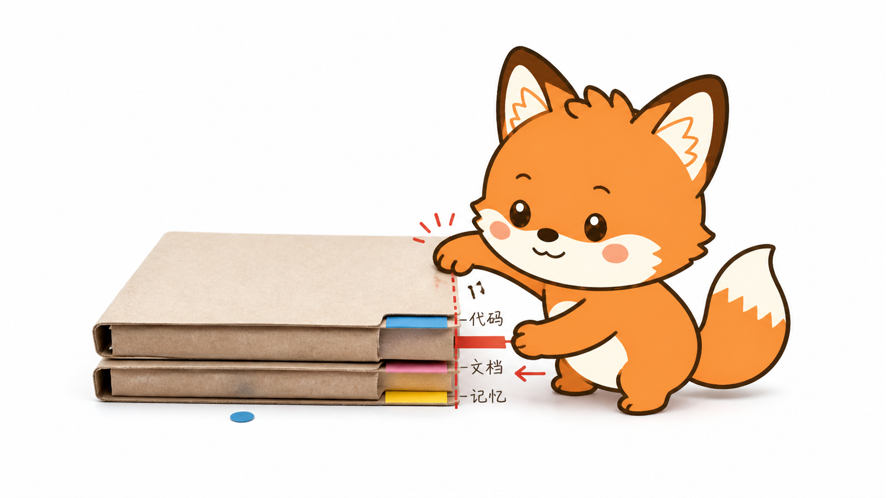

# 🦊 Azhou AI Hub · 阿舟 AI 能力站

**不止能演示，更要经得起真实任务。**

足够小，可以改；足够严，可以验；足够中立，可以跨 Agent Core 运行。

[English](README.md) · [安装](docs/installation.md) · [支持矩阵](docs/support-matrix.md) · [参与贡献](CONTRIBUTING.md)

很多 skill 仓库停在提示词。Azhou AI Hub 把每个 skill 当成产品：触发准确、运行包可移植、依赖可复现、检查可执行、评测不造假、来源可追踪、演化受人类控制。

这里不做接管一切的通用框架，不为每个模型复制一份 skill，也不把 benchmark 答案藏进运行包。

## 30 秒安装

安装一个 skill：

~~~bash
npx skills add TeFuirnever/azhou-ai-hub --skill repo-pedant
~~~

或者：

~~~bash
npx skills add TeFuirnever/azhou-ai-hub --skill excalidraw-diagram
~~~

只选一种安装方式。同一 canonical name 下，不要叠加托管安装、手工复制和开发软链接。手工安装与贡献者软链接见[安装指南](docs/installation.md)。

## Skills

| Skill | 解决的真实任务 | 当前证据 |
|---|---|---|
| [Repo Pedant](skills/repo-pedant/SKILL.md) | 明确任务结束时，用当前代码校正文档、项目规则、交接状态和已绑定项目 memory。 | 28/28 项 <code>neat-freak</code> 能力有机器映射；3 个注册行为 case；固定执行协议与 memory inventory 证明。 |
| [Excalidraw Diagram](skills/excalidraw-diagram/SKILL.md) | 生成或编辑可继续修改的图，渲染真实产物、查看成图，并按需交付 CJK-safe SVG/PNG。 | 5 个冻结 benchmark case；风格、场景、重叠和 same-DOM 确定性 gate。仓库 reference 只证明接线，不冒充模型效果。 |

两个包都可独立安装。运行时材料在 <code>skills/</code>；prompt、assertion、fixture 和 judge record 在仓库级 <code>benchmarks/</code>。

## 60 秒试用两个 Skill

| Skill | 复制给 Agent | 必须返回什么 |
|---|---|---|
| Repo Pedant | <code>这个阶段做完了，跑一次 repo-pedant reconcile。</code> | 已对齐的知识面、具名检查、明确 hold 和稳定收据。[运行 demo](docs/demos/repo-pedant.md)。 |
| Excalidraw Diagram | <code>用 excalidraw-diagram 画登录时序图，交付可编辑源图和 PNG。</code> | 可编辑 <code>.excalidraw</code>、真实渲染/导出、确定性 gate、视觉复核状态和稳定收据。[运行 demo](docs/demos/excalidraw-diagram.md)。 |

Demo 严格区分产品行为与 benchmark 主张：合成 fixture 只证明合同和 verifier 接线，只有冻结的 attempt-1 运行才算模型证据。

## 为什么可信

- **现役行为优先。** 代码、机器配置和真实运行证据定义 current truth；未实现 spec 保留为 reminder。
- **主张必须有 gate。** 仓库执行 82 项确定性测试、3-case Repo Pedant 套件、5-case Excalidraw benchmark 完整性检查、JSON/链接/来源/凭据策略和空白检查。
- **不伪装跨平台完全等价。** Codex、Claude Code、zcode 共用运行包，但 hook 与历史适配能力在[支持矩阵](docs/support-matrix.md)中分开写。
- **历史不能静默改 live skill。** promotion 必须先有回归，再通过确定性检查、paired 多数、无安全回归和 exact-diff 人类批准。
- **来源边界公开。** 上游快照、vendored 资产和未授权 prior art 的排除记录见[第三方声明](THIRD_PARTY_NOTICES.md)。

## Repo Pedant

> 🧹 代码是唯一现役答案，其他都要对齐。

任务确实结束时显式调用：

~~~text
这个阶段做完了，跑一次 repo-pedant reconcile。
~~~

只推测 milestone 时，skill 只提醒一次，不静默写仓库。明确 reconcile/handoff 默认覆盖三层项目知识：用户文档、<code>AGENTS.md</code>/<code>CLAUDE.md</code>、已证明属于当前项目的 memory。全局指令、归属不明 memory、整文件删除、发布和部署继续保留 checkpoint。

[兼容合同](skills/repo-pedant/references/neat-freak-compatibility.md) · [执行协议](skills/repo-pedant/references/execution-protocol.md)

> 🦊 效果图由 Azhou Scenes skill 生成。机器颜色门禁已通过；身份、手部和文字仍保留人工复核 checkpoint。

## Excalidraw Diagram

> ✏️ 先让结构讲清关系，再让文字补充证据。

JSON 可解析不等于完成。这个 skill 要求交付可编辑源图，用官方引擎渲染，实际查看图片，从源场景修复，再重跑 gate。离线字体、官方引擎、转换器和 231 个 MIT 许可的组件库随运行包提供。

> ✏️ 效果图由 Azhou Scenes skill 生成。机器颜色门禁已通过；身份、手部和文字仍保留人工复核 checkpoint。

[运行包](skills/excalidraw-diagram/SKILL.md) · [依赖安装](skills/excalidraw-diagram/references/setup.md) · [来源说明](skills/excalidraw-diagram/references/provenance.md)

## 一套架构

~~~text
docs/skill-standard.md ── 约束 ──> skills/<name>/       可安装运行包
          │                              │
          ├── 约束 ──────────────────> tests/              确定性证明
          └── 约束 ──────────────────> benchmarks/<name>/  隔离行为证据

历史信号 ──> 隔离 candidate ──> paired review ──> 人类 promotion
                    永远不直接写 live skill
~~~

[Azhou Skill Standard](docs/skill-standard.md) 是项目唯一准则。[架构说明](docs/architecture.md)解释边界，[治理规则](GOVERNANCE.md)解释决策方式。

## 开发

仓库级验证只需要 Python 3.11+：

~~~bash
python3 scripts/verify.py
~~~

同一条命令检查仓库策略、全部单元测试、两套 benchmark 完整性和 Git 空白。Excalidraw 真渲染需要额外锁定的 Python/Node 依赖，按自己的 setup 文档安装。

## 项目入口

- [路线图](docs/roadmap.md)
- [变更记录](CHANGELOG.md)
- [安全政策](SECURITY.md)
- [支持方式](SUPPORT.md)
- [本次开源化对标研究](docs/research/2026-08-23-open-source-benchmark.md)

贡献应从真实失败或真实任务开始，以可复现证据结束。先读 [CONTRIBUTING.md](CONTRIBUTING.md)。

## 许可证

阿舟自研代码使用 [MIT](LICENSE)。第三方组件保留自己的版权与许可证：[THIRD_PARTY_NOTICES.md](THIRD_PARTY_NOTICES.md)。
