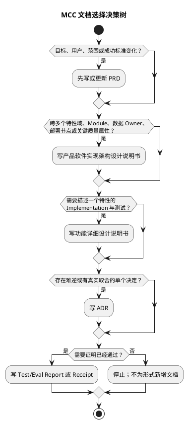
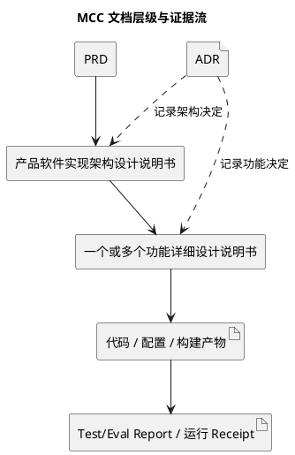

# MCC 设计文档模板选择入口

> **模板体系版本 `2.3` · 2026-09-01**
>
> MCC 不再使用一份“大而全”的 Design Doc 同时承担系统架构、功能 Implementation、验证结果和 ADR。设计文档按层级拆分；本文件只负责选择、组合、命名和证据边界。

## 1. 权威模板

| 文档 | 模板 | 回答的问题 | 主要读者 |
|---|---|---|---|
| PRD | [prd.md](prd.md) | Why / Who / What / Success | 产品、设计、工程、QA、决策人 |
| 产品软件实现架构设计说明书 | [software-implementation-architecture.md](software-implementation-architecture.md) | 整个产品如何组织、部署、运行并满足质量属性？ | 架构、技术负责人、运维、安全、下位设计 Owner |
| 功能详细设计说明书 | [feature-detailed-design.md](feature-detailed-design.md) | 一个特性具体如何实现、测试、失败、兼容和交付？ | 实现、QA、评审人、维护者 |
| ADR | 尚未建立统一模板；沿用仓库现有 ADR 约定 | 为什么选择一个难逆、意外或有真实取舍的决定？ | 决策参与者、未来维护者 |
| Test/Eval Report | 尚未建立统一模板；使用版本化 Report/Receipt | 实际运行是否达标，证据是什么？ | QA、算法、产品、发布决策人 |

模板采用的外部标准、厂商一手实践与 MCC 仓库约定，统一登记在[业界最佳实践基线](industry-best-practice-baseline.md)。该文件用于追踪依据与适用边界，不把厂商文章包装成官方模板。

本次二层结构吸收了内部《产品软件实现架构设计说明书模板》和《功能详细设计说明书模板》的原始骨架：前者的多架构视图、构建/交付/部署/运行模型和质量属性分析进入系统级模板；后者的实现思路、流程、Interface、代码与测试设计进入功能级模板。原始骨架中的层级错误和“价格资产”错字未保留。

### 1.1 统一输出格式

1. 权威源文件必须使用 UTF-8 Markdown，扩展名为 `.md`。HTML、PDF、Word、图片和幻灯片只能作为派生物，不能成为内容真源。
2. 标题、段落、列表、表格、引用、链接和代码使用标准 Markdown。结构化字段和对比矩阵使用 Markdown 表格。
3. 流程图、架构图、时序图、状态图、类图、ER 图、组件图和部署图统一使用 PlantUML fenced code block：代码块语言为 `plantuml`，内部使用匹配的 PlantUML 起止指令；普通图使用 `@startuml` / `@enduml`，WBS、MindMap 等专用图使用对应指令。语法与渲染行为以 [PlantUML 官方文档](https://plantuml.com/) 为准。
4. 每张图必须有图名，并在图外写明目的、范围、版本/日期和文字结论。图不得代替关键 Interface、约束、失败路径和取舍说明。
5. 图中名称必须与正文、Module、Interface、数据对象和部署节点一致。生成或评审前必须验证 PlantUML 可渲染。

### 1.2 业界规范对标

| 文档 | 对标基线 | 在 MCC 中的落实 |
|---|---|---|
| PRD | [ISO/IEC/IEEE 29148:2018](https://www.iso.org/standard/72089.html) 的需求信息项、需求质量和追溯原则 | 定义利益相关方、需求、约束、验收、优先级、来源和上下游追溯 |
| 产品软件实现架构说明书 | [ISO/IEC/IEEE 42010:2022](https://www.iso.org/standard/74393.html) 的利益相关方、关注点、视角、视图、模型和架构决定原则 | 明确架构范围、关注点、视图对应关系、Module、Interface、质量属性与决定 |
| 功能详细设计说明书 | 借鉴 [IEEE 1016-2009](https://standards.ieee.org/ieee/1016/4502/) 的 Software Design Description 信息组织；该标准当前为 `Inactive-Reserved`，仅作历史设计描述参考 | 定义设计实体、Interface、依赖、数据、行为、错误、验证和需求追溯，不声明 IEEE 合规认证 |

“对标”表示采用这些标准公开定义的信息职责和组织原则，不表示未经正式审计的合规认证。若标准更新，先核对变化，再更新模板版本和对标说明。

### 1.3 完整性门

文档进入 `In Review` 前必须同时满足：

- 所有必填章节有实质内容；条件必填项不适用时写明原因。
- 不保留 `<占位符>`、教学提示、伪造 Owner、虚构指标或未核实结论。
- 文档 ID、状态、Owner、评审人、版本、日期、范围和关联文档完整。
- 需求、设计、Implementation、测试/Eval 与证据位置可双向追溯。
- 当前事实、目标、假设、决定、风险和实际验证结果明确分层。
- Markdown 结构有效，本地链接可解析，PlantUML 图块边界完整且可渲染。
- 质量属性、失败路径、安全/隐私、兼容、发布、回滚和可观测性按适用范围闭合。
- `Planned`、`Implemented`、`Verified`、`Production` 分别记账；内容完整不能替代验证或生产证据。

### 1.4 文档剖面与受控剪裁

模板是**信息项模型**，不是按页数考核的排版样板。文档必须在控制表声明一种剖面：

| 剖面 | 适用场景 | 结构要求 |
|---|---|---|
| `Full` | 新产品、重大版本、新架构或进入正式评审的特性 | 保留模板全部一级章节；条件必填项不适用时写明原因 |
| `Baseline` | 对现有实现做逆向基线化、尚处 Research/Planned 的方案 | 可合并一级章节，但必须提供模板符合性矩阵和实现级设计补充，逐项映射模板全部一级信息项 |

`Baseline` 不等于降低完整性要求。剪裁时必须同时满足：

1. 每个模板一级编号都映射到一个具体章节，或写成“条件项不适用：原因”。
2. 安全、隐私、失败、兼容、发布、回滚、可观测性和验证不得仅因文档较短而删除。
3. 缺少事实或决定时，记录为开放问题或证据缺口，并给出 Owner 与关闭条件；不得补造答案。
4. 合并后的章节仍需区分 Interface、Implementation、数据/状态、流程、失败和验证。
5. 进入 `In Review` 前，评审人必须确认符合性矩阵与正文能双向定位；否则改用 `Full` 剖面重写。
6. 实现级设计补充至少包含：可调用 Interface 契约、状态/数据对象、算法或控制流、失败/并发/幂等矩阵、安全与可观测字段、验证矩阵、文件与 Module 变更清单。
7. 每张 Interface 表必须写清输入、输出、不变量、错误、权限、配置和性能边界；只列类名或函数名不算完整 Interface。

## 2. 选择规则

### 2.1 决策树

### 2.2 典型组合

| 变更类型 | PRD | 架构说明书 | 功能详细设计 | ADR | Test/Eval Report |
|---|---|---|---|---|---|
| 新产品/重大版本 | 必填 | 必填 | 每个可实现特性一份或多份 | 条件必填 | 发布前必填 |
| 跨特性架构改造 | 条件必填 | 必填 | 每个纵向切片条件必填 | 通常需要 | 必填 |
| 单个新功能 | 必填或引用已批准 PRD | 引用现有 ARCH；架构变化时更新 | 必填 | 条件必填 | 验证/发布前必填 |
| 算法策略或模型行为变化 | 更新算法需求与 Eval 门 | 跨系统影响时更新 | 必填 | 默认/契约难逆时需要 | 必填 |
| 内部重构 | 产品行为不变可不写 | 架构/Module/Seam 变化时更新 | 行为或 Interface 有风险时写 | 条件必填 | 回归证据必填 |
| 小型缺陷修复 | 通常不写 | 通常不写 | 简单且局部时不写；复杂状态/失败路径时写 | 通常不写 | 定向测试证据必填 |
| 单个依赖升级 | 行为/成本变化时更新 | 技术模型或部署变化时更新 | 迁移和兼容复杂时写 | 难逆时写 | 兼容与回归证据必填 |

## 3. 文档层级与分工

### 3.1 PRD

- 定义用户、问题、范围、需求、成功指标和发布门。
- 不定义代码 Module、函数、存储选型或部署拓扑。
- 产品目标、范围、验收变化必须先更新 PRD。

### 3.2 产品软件实现架构设计说明书

- 定义跨特性的 Module、Interface、Seam、Adapter、数据所有权和依赖方向。
- 定义逻辑、技术、数据、代码、构建、交付、部署和运行模型。
- 定义可测质量属性、容量、安全、韧性、可观测性和演进路线。
- 不复制函数级 Implementation、字段级测试用例和运行结果。

### 3.3 功能详细设计说明书

- 引用 PRD 和上位 ARCH，不重新决定整个产品架构。
- 定义单功能的 Implementation、流程、状态、Interface、数据、配置和错误。
- 定义单元、Interface、场景、异常、性能、安全和 AI Eval 的通过标准。
- 不把计划中的验证写成已通过结果。

### 3.4 ADR

- 一份 ADR 只记录一个决定。
- 记录上下文、候选、采用、后果和重开条件。
- 不用 ADR 代替完整架构或功能详细设计。

### 3.5 Test/Eval Report

- 固定代码、配置、模型、Prompt、数据集、环境、预算和 Trial。
- 报告绝对结果、相对差异、失败类别、成本、延迟和安全指标。
- 结果不可覆盖原运行；新运行产生新 ID/Receipt。

## 4. 防重复规则

1. 架构说明书定义跨特性的 Module 和 Interface；功能详细设计只引用，不复制整套系统图。
2. 架构说明书不写函数级 Implementation；功能详细设计不重新决定系统级技术栈和部署拓扑。
3. 数据 Owner 在架构说明书冻结；字段、事务和迁移细节在功能详细设计展开。
4. 质量属性目标在架构说明书冻结；功能详细设计只写本功能如何满足和验证。
5. Test/Eval 结果进入 Report；设计文档只写方法、阈值、失败动作和证据位置。
6. ADR 记录决定，不复制整份方案。
7. 任职资格证据引用真实产物；不能为覆盖能力清单扩大设计范围。

## 5. Module 设计语言

所有架构和功能详细设计统一使用以下术语：

| 术语 | 含义 |
|---|---|
| Module | 具有一个 Interface 和一个 Implementation 的设计单元，尺度不限 |
| Interface | 调用方正确使用 Module 必须知道的全部事实，包括不变量、顺序、错误、配置、权限和性能 |
| Implementation | Module 内部代码和行为 |
| Seam | 可以替换行为而不修改调用位置的 Interface 所在处 |
| Adapter | 在 Seam 上满足 Interface 的具体实现角色 |
| Depth | 一个小 Interface 隐藏大量复杂 Implementation 的程度 |
| Leverage | 调用方用较少 Interface 获得的能力 |
| Locality | 变更、缺陷、知识和验证集中在 Module 内的程度 |

约束：

- 一个 Module 只有一个对调用方呈现的 Interface。
- Interface 是调用方和测试共同跨越的验证面。
- 删除 Module 后复杂度若消失，它可能只是透传层；若复杂度扩散到多个调用方，它才提供 Locality。
- 一个 Adapter 意味着假想 Seam；两个真实 Adapter 或真实故障/平台变化轴才支持建立 Seam。

## 6. 命名与文件约定

| 文档 | ID | 建议目录 | 建议文件名 |
|---|---|---|---|
| PRD | `PRD-YYYY-NNN` | `docs/prd/` | `prd-YYYY-NNN-<slug>.md` |
| 架构说明书 | `ARCH-YYYY-NNN` | `docs/architecture/` | `arch-YYYY-NNN-<slug>.md` |
| 功能详细设计 | `DETAIL-YYYY-NNN` | `docs/design/` | `detail-YYYY-NNN-<slug>.md` |
| ADR | `ADR-NNN` 或仓库既有规则 | `docs/adr/` | `NNN-<slug>.md` |
| Test/Eval Report | `EVAL-YYYY-NNN` / `TEST-YYYY-NNN` | `docs/evals/` / `docs/test-reports/` | `<id>-<slug>.md` 或机器可读 Receipt |

规则：

- 产品名称和特性名称使用 MCC 中性能力名；实现来源名称只出现在实现证据中。
- 文件名稳定，不包含状态；状态写入文档控制表。
- 新版本不覆盖已批准的重要决定或运行结果。

## 7. 证据状态

| 状态 | 必需证据 | 不允许替代 |
|---|---|---|
| `Planned` | 设计、任务或验证计划 | 不得声称已实现 |
| `Implemented` | 代码、配置、构建或随包资产 | 不得声称测试达标 |
| `Verified` | 指定提交、环境、数据和配置的测试/Eval Receipt | 不得声称生产效果 |
| `Production` | 获批生产流量、生产 telemetry、发布和人工回执 | 本地、CI、论文或演示不得代替 |

## 8. 任职资格证据分工

| 文档 | 重点证据方向 | 不应强写 |
|---|---|---|
| PRD | 问题洞察、业务目标、算法需求、AI 规划、评测标准 | 函数级实现和已完成效果 |
| 架构说明书 | `C1` AI 规划、`C2` 系统设计、`C5` 工程实现，以及部署、数据、质量属性 | 单功能算法细节和个人贡献推断 |
| 功能详细设计 | `S2` 算法设计、`S3` 算法开发、`S4` 算法验证、`C3` 评估优化 | 整体系统 ownership 和生产效果推断 |
| Test/Eval Report | 指标、失败分类、对比、成本、安全和验证结论 | 未运行的计划 |

同一份证据可以被多份文档引用，但不得被包装成多个不同贡献。

## 9. 旧模板迁移

- 已批准的历史 Design Doc 保留，不要求机械重写。
- 新设计使用 v2 二层模板。
- 历史大 Design Doc 发生重大更新时：系统级内容迁入 ARCH，功能级内容迁入 DETAIL，运行结果迁入 Report。
- 迁移只改变文档组织，不自动改变产品行为、Interface、数据或发布状态。
- 无真实架构变化时，不为完成迁移新增空 ARCH。

## 10. 最小完成定义

设计工作只有在以下条件满足时结束：

- 选择了正确文档层级，没有用一份文档承担所有职责。
- 每项 Must 需求可追溯到设计和最小有效验证。
- Module、Interface、Implementation、Seam、Adapter 与状态所有权清楚。
- 当前事实、目标、假设、决定和结果分开。
- 风险、开放问题、Owner、日期和回退路径明确。
- 证据状态未越级；缺口被明确记录。
- 没有授权范围内剩余的必要设计工作。
