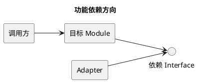
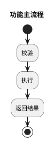
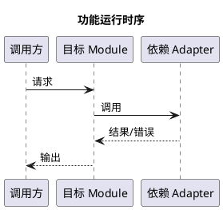
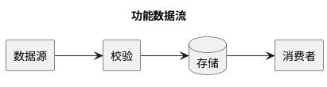

# 功能详细设计说明书：<功能或特性名称>

> **MCC 权威功能级详细设计模板** · 模板版本 `2.3` · 资料校验日期 `2026-09-01`
>
> 本模板用于一个特性、纵向切片或可独立验证的行为变更。它引用上位 PRD 与《产品软件实现架构设计说明书》，定义单功能的 Implementation、流程、Interface、数据、错误、测试和交付。跨特性的 Module 划分、数据所有权和部署拓扑不得在本文件中静默重做。

<!--
使用规则：
1. 将所有 <占位符> 替换为具体内容。
2. `Full` 剖面的“必填”部分不得删除；`Baseline` 剖面只可按 [受控剪裁规则](design-doc.md#14-文档剖面与受控剪裁)合并，并逐项给出模板符合性矩阵。条件必填部分不适用时写“不适用：原因”。
3. 每项 Must 需求必须追溯到 Implementation 和验证证据。
4. 当前行为、目标设计、假设、决定和结果分开写。
5. 使用 Module、Interface、Implementation、Seam、Adapter、Depth、Leverage、Locality；不要用“组件”替代 Module。
6. Interface 包含调用方必须知道的全部事实：参数、顺序、不变量、错误、配置、权限和性能，不只是一张方法表。
7. 测试通过才是 Verified；存在测试文件只证明验证入口存在。
8. 实际测试/Eval 结果进入独立 Report/Receipt，本文件只定义验证方法、通过标准和证据位置。
9. 权威源文件使用 UTF-8 Markdown `.md`；表格使用 Markdown，所有依赖、流程、状态、时序、类、ER、数据流和部署图使用具有匹配 PlantUML 起止指令的 `plantuml` 代码块。
10. 每张图必须有图名，并在图外写明目的、范围、版本/日期和文字结论；图中名称与正文术语一致，评审前验证 PlantUML 可渲染。
11. 设计描述借鉴 IEEE 1016-2009 的 Software Design Description 信息组织；该标准当前为 Inactive-Reserved，仅作历史参考，不声明 IEEE 合规认证。
12. 进入 In Review 前执行 [统一完整性门](design-doc.md#13-完整性门)：必填内容完整、占位符清零、链接有效、PlantUML 可渲染、需求—Implementation—验证可追溯。
13. `Baseline` 进入 In Review 前也必须提供实现级设计补充：Interface 契约、状态/数据、控制流、失败/并发/幂等、安全/观测、验证矩阵和文件变更清单；只有模板映射表不算详细设计完成。
-->

## 0. 文档控制（必填）

| 字段 | 内容 |
|---|---|
| Detail ID | `DETAIL-<YYYY>-<NNN>` |
| 功能/特性 | <名称> |
| 变更类型 | 新功能 / 行为变更 / 重构 / 迁移 / 退役 / 缺陷修复 |
| 文档剖面 | `Full` / `Baseline`（受控剪裁） |
| 状态 | `Draft` / `In Review` / `Approved` / `Implementing` / `Implemented` / `Superseded` / `Archived` |
| 设计负责人 | <DRI> |
| 实现负责人 | <Owner> |
| 决策负责人 | <有权批准 Interface、风险和发布门的人> |
| 核心评审人 | 产品：<…> · 架构：<…> · 实现：<…> · QA：<…> · 运维：<…> · 安全/隐私：<…或不适用> |
| 目标版本/里程碑 | <版本、Phase 或日期> |
| 创建日期 | <YYYY-MM-DD> |
| 最后更新 | <YYYY-MM-DD> |
| 关联 PRD | <PRD ID、版本和链接> |
| 上位架构说明书 | <ARCH ID、版本和章节链接> |
| 术语表 | 沿用 ARCH-2026-001 §3.1 词汇表定义，不另行定义；确需新增术语时先补入该表 |
| 相关 ADR | <ADR 或无> |
| 实现链接 | <任务、PR、commit 或待定> |
| Test/Eval Report | <报告/Receipt 或待创建> |
| 任职资格证据目标 | <算法设计、开发、验证、优化或工程实现能力；通常不超过 4-8 项> |
| 取代文档 | <旧详细设计或无> |

## 1. 功能摘要与决策请求（必填）

### 1.1 一句话实现方案

> 为满足 <PRD 需求>，本功能在上位架构 <ARCH ID/章节> 下，通过 <核心 Module、Interface 和算法/规则> 实现 <结果>；关键取舍是 <取舍>。

### 1.2 请求批准

- 请求批准：<Interface、Implementation、数据、算法、错误、兼容、验证和发布门>。
- 不在本次批准范围：<跨系统架构、远期 Phase、独立功能>。
- 最大风险：<风险>。
- 回退方案：<功能级回退>。

### 1.3 功能总览

<!-- 用 5-10 句话说明当前问题、目标行为、主要 Module、数据/控制流、失败路径和验证。 -->

<功能总览>

## 2. 背景、范围与需求追溯（必填）

### 2.1 用户/系统问题

| 问题 ID | 角色/调用方 | 场景 | 当前行为 | 影响 | 证据 |
|---|---|---|---|---|---|
| `P-01` | <角色> | <场景> | <行为> | <影响> | <用户、代码、工单、指标> |

### 2.2 当前实现

| 当前 Module/流程 | 已核实行为 | 证据 | 局限 |
|---|---|---|---|
| <Module/流程> | <事实> | <代码、配置、测试、运行记录> | <问题> |

### 2.3 PRD 需求追溯

| PRD ID | 产品要求/验收 | 本详细设计响应 | 验证章节 |
|---|---|---|---|
| `FR-001` | <要求> | <Interface/Implementation> | §<…> |

### 2.4 上位架构约束追溯

| ARCH ID/章节 | 架构约束 | 本功能如何遵守 | 偏差/ADR |
|---|---|---|---|
| `ARCH-… §…` | <Module、Interface、数据所有权、依赖或质量属性> | <响应> | <无/偏差> |

### 2.5 范围与非目标

| 类型 | 内容 | 原因/所有者 |
|---|---|---|
| 范围内 | <行为、Module、Interface、数据、测试> | <原因> |
| 范围外 | <不处理的系统/行为> | <上位架构/其他 Detail/YAGNI> |

### 2.6 不改变的外部行为

- <兼容、协议、数据、权限或用户行为>。

## 3. 约束、原则与不变量（必填）

### 3.1 功能与非功能约束

| ID | 类型 | 约束/要求 | 来源 | Implementation 影响 |
|---|---|---|---|---|
| `C-01` | 功能 / 性能 / 安全 / 隐私 / 平台 / 成本 / 兼容 | <内容> | <PRD/ARCH/协议/代码> | <影响> |

### 3.2 设计原则

1. **<原则名>**：<冲突时如何选择>。
2. **深 Module**：以小 Interface 隐藏复杂 Implementation，不把内部步骤泄漏给调用方。
3. **Interface 即测试面**：调用方与测试跨越同一 Seam。

### 3.3 不变量

- <任何 Implementation 都必须保持的权限、数据、状态或顺序不变量>。
- <失败和降级也不得破坏的不变量>。

## 4. 功能实现思路与方案取舍（必填）

### 4.1 核心机制

<用短文说明功能如何工作，避免直接陷入文件和函数。>

### 4.2 方案选项

| 选项 | 描述 | 用户价值 | Interface 复杂度 | Implementation 复杂度 | 风险 | 可逆性 | 结论 |
|---|---|---|---|---|---|---|---|
| A | <方案> | 高 / 中 / 低 | 高 / 中 / 低 | 高 / 中 / 低 | <风险> | <可逆性> | 采用 / 拒绝 |

### 4.3 采用结论

- 采用：<选项>。
- 原因：<关键约束与取舍>。
- 放弃什么：<代价>。
- 重开条件：<什么证据会改变决定>。
- ADR：<需要/不需要及原因>。

### 4.4 删除测试与 Depth 判断

- 删除此 Module 后，复杂度会消失还是扩散到多个调用方？<答案>。
- 调用方需要学习多少 Interface？<答案>。
- Module 隐藏了哪些复杂度并提供什么 Leverage？<答案>。
- 是否存在只有一个 Adapter 的假想 Seam？<答案与处理>。

## 5. Module、Interface 与代码设计（必填）

### 5.1 Module 与职责

| Module | Interface | 职责 | 输入 | 输出 | 状态所有权 | 依赖 | Depth/Leverage |
|---|---|---|---|---|---|---|---|
| <Module> | <调用方必须知道的事实> | <单一职责> | <输入> | <输出> | <拥有/不拥有> | <依赖> | <隐藏复杂度> |

### 5.2 Seam 与 Adapter

| Seam | Interface | Adapter | 真实变化轴 | 错误语义 | 测试 Adapter |
|---|---|---|---|---|---|
| <位置> | <契约> | <两个或以上真实 Adapter> | <平台/故障/替换> | <错误> | <fake/in-memory> |

### 5.3 依赖方向



| 来源 Module | 允许依赖 | 禁止依赖 | 原因 | 验证 |
|---|---|---|---|---|
| <来源> | <目标> | <目标> | <原因> | <静态检查/评审> |

### 5.4 代码元素清单

| 代码元素 | 类型 | 路径 | 职责 | 新增/修改/删除 | Owner |
|---|---|---|---|---|---|
| <名称> | Module / Interface / Adapter / Implementation / Schema / Test | <路径> | <职责> | <动作> | <Owner> |

### 5.5 关键算法或伪代码（条件必填）

```text
INPUT: <输入>
OUTPUT: <输出>

1. <步骤>
2. <步骤>
3. <停止或失败条件>
```

- 时间复杂度：<分析或不适用>。
- 空间复杂度：<分析或不适用>。
- 数值/排序/边界条件：<规则>。

## 6. 功能行为设计（必填）

### 6.1 主流程



| 步骤 | 调用方意图/事件 | Module 行为 | 状态变化 | 输出 | 失败 |
|---|---|---|---|---|---|
| 1 | <事件> | <行为> | <变化> | <输出> | <失败> |

### 6.2 运行时序



### 6.3 状态机（条件必填）

| 当前状态 | 事件 | 守卫条件 | 下一状态 | 副作用 | 失败/补偿 |
|---|---|---|---|---|---|
| <状态> | <事件> | <条件> | <状态> | <动作> | <补偿> |

### 6.4 分支与边界条件

| 条件 | 行为 | 返回/状态 | 可观察信号 | 测试用例 |
|---|---|---|---|---|
| 空输入 / 最小值 / 最大值 / 重复 / 过期 / 冲突 | <行为> | <结果> | <信号> | <ID> |

### 6.5 取消与恢复

- 取消入口：<用户、超时、上游取消>。
- 取消传播：<Module/Adapter>。
- 临时状态清理：<规则>。
- 恢复与重放：<规则>。

## 7. Interface 契约（必填）

### 7.1 命令、HTTP、SDK 或事件 Interface

| Interface | 调用方 | 输入 | 输出 | 错误 | 权限 | 幂等 | 性能特征 | 版本策略 |
|---|---|---|---|---|---|---|---|---|
| <名称> | <调用方> | <schema> | <schema> | <错误码/异常> | <规则> | <key/不适用> | <延迟/容量> | <策略> |

### 7.2 输入输出 Schema

```text
<Schema、字段、枚举、必填/可选、默认值>
```

### 7.3 校验与规范化

| 字段/对象 | 校验 | 规范化 | 默认值 | 非法输入行为 |
|---|---|---|---|---|
| <字段> | <范围/格式> | <转换> | <值> | <错误> |

### 7.4 错误语义

| 错误类 | 条件 | 调用方可见行为 | 可重试 | 记录 | 恢复 |
|---|---|---|---|---|---|
| <错误> | <条件> | <返回/异常> | 是 / 否 / 条件 | <字段> | <动作> |

## 8. 数据与配置设计（必填）

### 8.1 数据对象

| 数据对象 | Owner | 字段/Schema | 读者 | 写者 | 一致性 | 生命周期 |
|---|---|---|---|---|---|---|
| <对象> | <Module> | <链接/摘要> | <主体> | <主体> | 强 / 最终 / 其他 | <创建—更新—删除> |

### 8.2 数据流



### 8.3 事务、一致性与并发更新

- 事务范围：<范围或不适用>。
- 一致性模型：<模型>。
- 冲突检测：<机制>。
- 重复写/乱序：<处理>。
- 删除与恢复：<规则>。

### 8.4 配置契约

| 配置项 | Owner | 默认值 | 有效范围 | 校验 | 动态生效 | 敏感性 | 变更后验证 |
|---|---|---|---|---|---|---|---|
| <配置> | <Module> | <值> | 全局 / 租户 / 会话 / 请求 | <规则> | 是 / 否 | 普通 / 敏感 / 密钥 | <测试> |

### 8.5 数据迁移（条件必填）

| 阶段 | 数据变化 | 前置条件 | 校验 | 回滚/补偿 | Owner |
|---|---|---|---|---|---|
| <阶段> | <变化> | <条件> | <校验> | <动作> | <Owner> |

## 9. 算法与 AI 设计（条件必填）

### 9.1 算法目标与基线

| 项目 | 内容 |
|---|---|
| 任务定义 | <输入、输出、目标> |
| 当前 baseline | <算法/规则/模型> |
| 主要指标 | <Recall、MRR、nDCG、accuracy、latency、cost 等> |
| 护栏指标 | <安全、false recall、泄漏、过度拒绝等> |
| 数据集 | <来源、版本、样本、权限> |

### 9.2 模型、Prompt 与 Schema

| 构成 | 设计 | 版本 | Owner | 失败行为 |
|---|---|---|---|---|
| 模型 | <选择/路由> | <版本> | <Owner> | <降级> |
| Prompt | <层级/输入> | <revision> | <Owner> | <冲突> |
| 输出 Schema | <结构/校验> | <版本> | <Owner> | <坏输出> |

### 9.3 阈值、排序与预算

| 参数 | 含义 | 当前值 | 候选值 | 选择依据 | 验证 |
|---|---|---|---|---|---|
| <threshold/top-K/token/depth/trials> | <含义> | <值> | <值> | <baseline/实验> | <Eval> |

### 9.4 模型与宿主控制权

| 能力 | 模型可决定 | 宿主强制 | 人工门 | 证据 |
|---|---|---|---|---|
| 读取 / 工具 / 状态 / 停止 | <范围> | <权限/预算/事务/超时> | <条件> | <Trace/Receipt> |

### 9.5 不可信输入

- 来源：<用户、网页、文件、工具结果等>。
- 隔离与标记：<设计>。
- 权限不随文本提升：<硬控制>。
- 攻击/污染失败行为：<拒绝/降级/人工>。

### 9.6 Eval 设计

| Eval ID | 对应需求 | 输入/任务 | Baseline | Candidate | Grader | 阈值 | Trial | 失败动作 |
|---|---|---|---|---|---|---|---|---|
| `EV-001` | <FR> | <任务> | <基线> | <候选> | 代码 / 模型 / 人工 / 混合 | <值> | <N> | 阻断 / 降级 / 记录 |

## 10. 失败、并发、降级与恢复（必填）

### 10.1 失败模式

| ID | 失败模式 | 检测 | 影响 | 自动处理 | 人工处理 | 恢复目标 | 验证 |
|---|---|---|---|---|---|---|---|
| `F-01` | <失败> | <信号> | <影响> | <重试/熔断/补偿/降级> | <Runbook> | <目标> | <测试> |

### 10.2 超时与重试

- 超时预算：<总预算和阶段预算>。
- 可重试错误：<列表>。
- 不可重试错误：<列表>。
- 重试次数、退避、抖动：<规则>。
- 重试后不变量：<规则>。

### 10.3 并发与竞态

| 并发场景 | 共享状态 | 竞态 | 控制 | 饥饿/死锁风险 | 验证 |
|---|---|---|---|---|---|
| <场景> | <状态> | <风险> | 锁 / CAS / 队列 / 串行化 / 无共享 | <风险> | <测试> |

### 10.4 幂等、部分成功与补偿

- 幂等键与范围：<定义或不适用>。
- 重复请求：<行为>。
- 部分成功：<返回和状态>。
- 补偿/对账：<动作>。

### 10.5 降级矩阵

| 依赖/能力不可用 | 降级行为 | 调用方提示 | 数据处理 | 恢复后动作 |
|---|---|---|---|---|
| <依赖> | <行为> | <提示> | <保留/排队/丢弃> | <补偿/重放/无> |

## 11. 安全、隐私与可观测性（必填）

### 11.1 数据与信任

| 数据/资产 | 分类 | 来源 | 存储/传输 | 访问主体 | 保留/删除 |
|---|---|---|---|---|---|
| <数据> | 公开 / 内部 / 敏感 / 密钥 | <来源> | <位置> | <主体> | <规则> |

### 11.2 威胁与控制

| 威胁 | 路径 | 影响 | 预防 | 检测 | 响应 | 剩余风险 |
|---|---|---|---|---|---|---|
| <威胁> | <路径> | <影响> | <控制> | <信号> | <动作> | <风险> |

### 11.3 可观测性

| 信号 | 目的 | 字段/维度 | 阈值 | 告警对象 | 保留期 | 隐私处理 |
|---|---|---|---|---|---|---|
| 指标 / 日志 / Trace / Receipt | <目的> | <字段> | <阈值> | <Owner> | <期限> | <规则> |

- 健康定义：<成功、失败、部分成功>。
- 最短诊断路径：<请求 ID → Module → Adapter → 状态/错误>。
- 证据边界：<本地 / CI / 离线 Eval / 生产 / 人工分别证明什么>。

## 12. 兼容、发布与回滚（必填）

### 12.1 兼容性

| 消费者/依赖 | 当前契约 | 新契约 | 兼容策略 | 退役日期 | Owner |
|---|---|---|---|---|---|
| <主体> | <契约> | <契约> | 向后兼容 / 双写 / Adapter / 破坏性 | <日期> | <Owner> |

### 12.2 发布阶段

| 阶段 | 范围 | 开始条件 | 观察指标 | 退出条件 | 回滚点 | Owner |
|---|---|---|---|---|---|---|
| 内部 / Shadow / 灰度 / 全量 | <人群/流量> | <门> | <指标> | <扩大/停止> | <动作> | <Owner> |

### 12.3 回滚

- 回滚触发：<指标、事故、用户影响>。
- 回滚动作：<配置、代码、数据、流量>。
- 回滚时间目标：<值>。
- 不可逆步骤：<批准、备份、恢复证据>。
- 用户/调用方沟通：<对象、渠道、Owner>。

## 13. 测试与验证设计（必填）

### 13.1 声明—证据矩阵

| 声明 ID | 要证明的行为/属性 | 最小有效验证 | 通过标准 | 证据位置 | Owner |
|---|---|---|---|---|---|
| `V-01` | <声明> | 单元 / Interface / 集成 / E2E / 压测 / 安全 / Eval | <标准> | <Report/Receipt> | <Owner> |

### 13.2 单元测试

| Test ID | Module/规则 | 输入 | 期望 | 边界/错误 | Mock/Fake | 触发 |
|---|---|---|---|---|---|---|
| `UT-001` | <Interface/Implementation> | <输入> | <结果> | <边界> | <Adapter> | 每次变更 |

### 13.3 Interface 测试

| Test ID | Interface | 调用方/Adapter | 契约 | 通过标准 | 失败动作 |
|---|---|---|---|---|---|
| `IT-001` | <Interface> | <主体> | <输入/输出/错误/权限/性能> | <标准> | 阻断 |

### 13.4 业务场景测试

| Test ID | 场景 | 前置条件 | 操作 | 期望结果 | 证据 |
|---|---|---|---|---|---|
| `ST-001` | <主路径> | <条件> | <操作> | <用户/系统结果> | <Report> |

### 13.5 异常场景测试

| Test ID | 异常/故障 | 注入方式 | 期望失败/降级 | 数据/状态 | 恢复 |
|---|---|---|---|---|---|
| `FT-001` | <异常> | <方法> | <行为> | <约束> | <动作> |

### 13.6 性能、容量与恢复测试（条件必填）

| Test ID | 目标 | 环境 | 负载/数据 | 指标 | 阈值 | 失败动作 |
|---|---|---|---|---|---|---|
| `NFT-001` | <性能/容量/恢复> | <环境> | <条件> | <P95/吞吐/RTO 等> | <值> | <回退> |

### 13.7 安全与权限测试（条件必填）

| Test ID | 威胁/权限 | 输入/主体 | 期望控制 | 泄漏/执行阈值 | 失败动作 |
|---|---|---|---|---|---|
| `SEC-001` | <威胁> | <主体> | <拒绝/隔离/审计> | <通常为 0> | 阻断 |

### 13.8 AI Eval 与回归（条件必填）

| Eval ID | 数据集/版本 | Baseline | Candidate | Grader | 指标/阈值 | Trial | 产物 |
|---|---|---|---|---|---|---|---|
| `EV-001` | <数据> | <基线> | <候选> | <grader> | <值> | <N> | <Report/Receipt> |

### 13.9 生产验证

- 发布前能证明：<范围>。
- 只能在生产证明：<范围>。
- 观察窗口：<时长或待定依据>。
- 人工验收：<角色、清单、证据>。
- 停止/回滚阈值：<阈值>。

## 14. 实施计划（必填）

### 14.1 纵向切片

| Phase | 范围 | 主要交付 | 依赖 | 退出条件 | Owner |
|---|---|---|---|---|---|
| 0 · Spike | <未知项> | <证据> | <依赖> | <继续/停止条件> | <Owner> |
| 1 · MVP | <最小主路径> | <能力> | <依赖> | <测试/指标> | <Owner> |
| 2 · Hardening | <失败/安全/运维> | <能力> | <依赖> | <发布门> | <Owner> |

### 14.2 文件与 Module 变更

| 文件/路径 | Module | 动作 | 变更摘要 | 测试 | Owner |
|---|---|---|---|---|---|
| <路径> | <Module> | 新增 / 修改 / 删除 | <内容> | <Test ID> | <Owner> |

### 14.3 顺序、并行与集成

- 必须先完成：<前置>。
- 可并行：<独立工作>。
- 共享 Interface/文件 Owner：<Owner>。
- 集成点：<时点与验证>。

## 15. 风险、开放问题、ADR 与实现偏差（必填）

### 15.1 风险

| ID | 风险 | 概率 | 影响 | 缓解 | 触发信号 | Owner |
|---|---|---|---|---|---|---|
| `R-01` | <风险> | 高 / 中 / 低 | 高 / 中 / 低 | <动作> | <信号> | <Owner> |

### 15.2 开放问题

| ID | 问题 | 阻断点 | Owner | 截止日期 | 结果 |
|---|---|---|---|---|---|
| `Q-01` | <问题> | 批准 / 实现 / 发布 / 不阻断 | <Owner> | <日期> | <待定> |

### 15.3 ADR

| 决定 | 真实取舍/难逆性 | 状态 | 链接 |
|---|---|---|---|
| <决定> | <原因> | Proposed / Accepted / Superseded | <ADR> |

### 15.4 实现偏差

| 偏差 | 获批设计 | 实际实现 | 原因 | 风险/后续 | 是否重新批准 |
|---|---|---|---|---|---|
| <偏差> | <设计> | <实现> | <原因> | <影响> | 是 / 否 |

## 16. 任职资格证据附录（条件必填）

<!-- 功能详细设计通常重点映射 S2/S3/S4/C3/C5。系统级规划和部署能力优先引用上位架构说明书。 -->

### 16.1 算法与工程闭环

| 阶段 | 核心问题 | 本设计内容 | 产物与证据 | 结论/下一步 |
|---|---|---|---|---|
| 调研与洞察 | <问题> | <基线/候选/研究> | <资料/代码审计> | <采用/待验证> |
| 算法设计 | <目标函数/机制> | <方案/不变量/取舍> | <章节/ADR> | <结论> |
| 算法开发 | <实现> | <Module/Interface/数据流> | <代码/PR> | <状态> |
| 算法验证 | <证明方法> | <数据/指标/Trial> | <Test/Eval Report> | <结果/缺口> |
| 评估与优化 | <瓶颈> | <误差分析/优化> | <对比报告> | <收益/风险> |

### 16.2 任职资格证据矩阵

| 能力 ID | 本功能体现 | 设计证据 | 实现证据 | 验证证据 | 状态 | 个人贡献 |
|---|---|---|---|---|---|---|
| <K/S/C ID> | <设计、开发、验证、优化> | <章节/ADR> | <代码/PR> | <测试/Eval/指标> | Planned / Implemented / Verified / Production | <可核验贡献> |

### 16.3 不适用与证据缺口

| 能力/声明 | 结论 | 原因 | 补强产物 | 是否阻断 |
|---|---|---|---|---|
| <能力> | 不适用 / 证据不足 | <原因> | <测试、实验、运行回执或无> | 是 / 否 |

## 17. 评审、批准与变更记录（必填）

### 17.1 Detail Design Review Gate

- [ ] 权威源文件为 UTF-8 Markdown；结构化字段使用 Markdown 表格；所有图使用 PlantUML，边界匹配且已验证可渲染。
- [ ] 已按 IEEE 1016-2009 历史 SDD 对标剖面检查设计实体、Interface、依赖、数据、行为、错误、验证和需求追溯；未声明现行合规认证。
- [ ] 已通过[统一完整性门](design-doc.md#13-完整性门)：必填项有实质内容，占位符清零，本地链接有效。
- [ ] PRD 和上位架构说明书已批准，或 Spike 有明确范围和退出条件。
- [ ] 每项 Must 需求追溯到 Interface、Implementation 和验证。
- [ ] 当前行为、目标设计、假设和结果已分开。
- [ ] Module、Interface、Implementation、Seam、Adapter 和状态所有权明确。
- [ ] Interface 包含参数、顺序、不变量、错误、配置、权限和性能。
- [ ] Baseline 剖面具有实现级设计补充；每项补充可定位到当前代码或明确的目标 Module，未用概括性段落代替契约。
- [ ] 每个 Seam 有真实变化轴；没有单 Adapter 假想层。
- [ ] 主流程、分支、状态、取消和恢复完整。
- [ ] 数据、配置、事务、一致性和迁移明确。
- [ ] 失败、超时、重试、并发、幂等、部分成功和降级可验证。
- [ ] 安全、隐私、日志、指标、Trace 和诊断路径明确。
- [ ] 兼容、发布和回滚可执行。
- [ ] 单元、Interface、业务、异常和必要非功能测试有通过标准。
- [ ] AI/Agent 设计区分模型、宿主和人工控制，并有 Eval 门。
- [ ] 任职资格映射只使用直接证据，个人贡献待真实 ownership 支持。
- [ ] 实施计划按可独立验证的纵向切片拆分。

### 17.2 批准记录

| 角色 | 姓名 | 结论 | 日期 | 条件/备注 |
|---|---|---|---|---|
| 产品 | <…> | Approve / Revise / Reject | <日期> | <…> |
| 架构 | <…> | Approve / Revise / Reject | <日期> | <…> |
| 实现 Owner | <…> | Approve / Revise / Reject | <日期> | <…> |
| QA | <…> | Approve / Revise / Reject | <日期> | <…> |
| 运维 | <…> | Approve / Revise / Not applicable | <日期> | <…> |
| 安全/隐私 | <…> | Approve / Revise / Not applicable | <日期> | <…> |

### 17.3 变更记录

| 版本 | 日期 | 变更 | 原因 | 是否重新批准 |
|---|---|---|---|---|
| `0.1` | <日期> | 初稿 | <原因> | 否 |

## 参考依据

- [IEEE 1016-2009：Software Design Descriptions（Inactive-Reserved）](https://standards.ieee.org/ieee/1016/4502/)
- [Google Documentation Best Practices](https://google.github.io/styleguide/docguide/best_practices.html)
- [Microsoft：Develop an architecture design specification](https://learn.microsoft.com/en-us/azure/well-architected/architect-role/architecture-design-specification)
- [Microsoft：Maintain an architecture decision record](https://learn.microsoft.com/en-us/azure/well-architected/architect-role/architecture-decision-record)
- [Anthropic：Building effective agents](https://www.anthropic.com/engineering/building-effective-agents)
- [Anthropic：Demystifying evals for AI agents](https://www.anthropic.com/engineering/demystifying-evals-for-ai-agents)
- [OpenAI：A practical guide to building AI agents](https://openai.com/business/guides-and-resources/a-practical-guide-to-building-ai-agents/)
- [Apple Human Interface Guidelines：Generative AI](https://developer.apple.com/design/human-interface-guidelines/generative-ai)
