# 产品软件实现架构设计说明书：<产品或系统名称>

> **MCC 权威系统级架构设计模板** · 模板版本 `2.3` · 资料校验日期 `2026-09-01`
>
> 本模板用于产品整体、重大版本或跨特性域设计。它定义系统级 Module、Interface、数据所有权、技术模型、部署运行模型与质量属性，是下位功能详细设计的架构真源。函数级实现和测试用例进入《功能详细设计说明书》；实际运行结果进入独立 Test/Eval Report。

<!--
使用规则：
1. 将所有 <占位符> 替换为具体内容。
2. `Full` 剖面的“必填”部分不得删除；`Baseline` 剖面只可按 [受控剪裁规则](design-doc.md#14-文档剖面与受控剪裁)合并，并逐项给出模板符合性矩阵。条件必填部分不适用时写“不适用：原因”。
3. 当前事实、目标设计、假设、决定和验证结果必须分开。
4. 权威源文件使用 UTF-8 Markdown `.md`；表格使用 Markdown，所有架构、流程、状态、时序、类、ER、组件和部署图使用具有匹配 PlantUML 起止指令的 `plantuml` 代码块。
5. 质量属性必须写成可测场景，不能只写“高性能”“高可用”。
6. 使用 Module、Interface、Implementation、Seam、Adapter、Depth、Leverage、Locality；不要用“组件”替代 Module。
7. 一个 Adapter 代表假想 Seam；只有存在两个真实实现或明确故障/替换轴时才建立 Seam。
8. 架构说明书不复制函数级实现。下位详细设计通过 ARCH ID 和章节链接引用本文件。
9. 代码存在只证明 Implemented；测试、离线 Eval、生产和人工批准分别记账。
10. 每张图必须有图名，并在图外写明目的、范围、版本/日期和文字结论；图中名称与正文术语一致，评审前验证 PlantUML 可渲染。
11. 架构描述对标 ISO/IEC/IEEE 42010:2022 的利益相关方、关注点、视角、视图、模型和决定原则；“对标”不表示未经正式审计的合规认证。
12. 进入 In Review 前执行 [统一完整性门](design-doc.md#13-完整性门)：必填内容完整、占位符清零、链接有效、PlantUML 可渲染、需求—架构—下位设计可追溯。
13. `Baseline` 进入 In Review 前也必须给出跨 Module Interface 参数/错误/权限/性能契约、数据一致性、故障域、容量预算、发布回退和下位设计责任分配；只有架构框图和 Module 清单不算完成。
-->

## 0. 文档控制（必填）

| 字段 | 内容 |
|---|---|
| Architecture ID | `ARCH-<YYYY>-<NNN>` |
| 产品/系统 | <名称> |
| 架构范围 | <整体产品 / 重大版本 / 跨特性域变更> |
| 文档剖面 | `Full` / `Baseline`（受控剪裁） |
| 状态 | `Draft` / `In Review` / `Approved` / `Implementing` / `Implemented` / `Superseded` / `Archived` |
| 架构负责人 | <DRI> |
| 决策负责人 | <有权批准架构目标、风险和演进路线的人> |
| 核心评审人 | 产品：<…> · 架构：<…> · 实现：<…> · QA：<…> · 运维：<…> · 安全/隐私：<…> |
| 目标版本/里程碑 | <版本、Phase 或日期> |
| 创建日期 | <YYYY-MM-DD> |
| 最后更新 | <YYYY-MM-DD> |
| 关联 PRD | <PRD ID、版本和链接> |
| 下位详细设计 | <DETAIL ID 列表或待创建> |
| 相关 ADR | <ADR 列表或无> |
| 当前实现基线 | <branch/tag/commit/build> |
| 运行文档 | <部署、Runbook、监控、接口目录或待创建> |
| 任职资格证据目标 | <系统设计相关 K/S/C 项；通常不超过 4-8 项> |
| 取代文档 | <旧架构说明书或无> |

## 1. 执行摘要与决策请求（必填）

### 1.1 一句话架构方案

> 为满足 <PRD/业务目标>，系统采用 <核心架构方案>，通过 <关键 Module、Interface 和运行模型> 实现 <可验证结果>；关键取舍是 <取舍>。

### 1.2 请求批准

- 请求批准：<架构目标、Module 划分、Interface、数据所有权、技术模型、部署模型、风险接受、演进路线>。
- 不在本次批准范围：<下位 Implementation、远期 Phase、实验性能力>。
- 最大风险：<风险及影响>。
- 回退方向：<架构级回退或停止条件>。

### 1.3 架构总览

<!-- 用 5-10 句话说明当前问题、目标形态、关键 Module、数据/控制流、部署运行方式和验证门。 -->

<架构总览>

## 2. 简介与范围（必填）

### 2.1 目的与读者

- 文档目的：<本说明书冻结什么决定>。
- 目标读者：<产品、架构、开发、QA、运维、安全等>。
- 使用方式：<下位详细设计、评审、实现和运行如何引用>。

### 2.2 背景与当前问题

| 问题 ID | 当前事实 | 影响 | 证据 | 是否架构问题 |
|---|---|---|---|---|
| `P-01` | <事实> | <用户/业务/系统影响> | <代码、指标、事故、研究> | 是 / 否 |

### 2.3 范围与非目标

| 类型 | 内容 | 原因/所有者 |
|---|---|---|
| 范围内 | <产品、特性域、Module、数据和运行环境> | <原因> |
| 范围外 | <不处理的系统或实现细节> | <已有 Owner / YAGNI / 后续 Phase> |

### 2.4 与 PRD 和详细设计的分工

- PRD 定义：Why / Who / What / Success。
- 本架构说明书定义：系统级 How、质量属性、Module、Interface、数据所有权和运行模型。
- 功能详细设计定义：单特性的 Implementation、流程、错误、测试和交付。
- ADR 定义：单个难逆决定及其取舍。
- Test/Eval Report 定义：实际运行结果与证据。

## 3. 概念模型与系统用例（必填）

### 3.1 核心概念模型

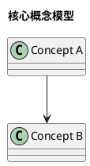

- 图的目的：<解释哪些核心概念及关系>。
- 范围：<包含/不包含>。
- 版本与日期：<vN · YYYY-MM-DD>。
- 文字结论：<概念定义、所有权和关系>。

### 3.2 系统上下文模型

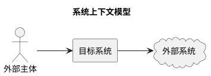

| 外部主体/系统 | 与本系统关系 | 输入 | 输出 | 信任级别 | Owner |
|---|---|---|---|---|---|
| <主体/系统> | <调用/依赖/数据源/运维> | <输入> | <输出> | 可信 / 部分可信 / 不可信 | <Owner> |

### 3.3 关键系统用例

| 用例 ID | 主体 | 目标 | 前置条件 | 主成功结果 | 关键失败 |
|---|---|---|---|---|---|
| `UC-01` | <主体> | <目标> | <条件> | <结果> | <失败> |

### 3.4 外部 Interface 概览

<!-- 系统级只列 Interface 类型、所有权和稳定性；字段级契约进入下位详细设计。 -->

| Interface | 调用方/依赖 | 职责 | 稳定性 | 权限 | 详细契约 |
|---|---|---|---|---|---|
| <HTTP / SDK / CLI / Event / File / Protocol> | <主体> | <职责> | Stable / Evolving / Internal | <规则> | <DETAIL/API 链接> |

## 4. 架构目标与关键质量属性（必填）

### 4.1 业务定位与架构目标

| 目标 ID | 架构目标 | 支撑的业务/产品目标 | 可观察结果 | 优先级 |
|---|---|---|---|---|
| `AG-01` | <目标> | <PRD/G ID> | <结果> | Must / Should / Could |

### 4.2 关键架构需求

| 需求 ID | 架构需求 | 来源 | 设计响应 | 验证章节 |
|---|---|---|---|---|
| `AR-01` | <跨 Module、数据、运行或质量属性需求> | <PRD/政策/现状> | <响应> | §<…> |

### 4.3 质量属性场景

| ID | 属性 | 来源 | 刺激 | 环境 | 受影响对象 | 响应 | 测量值 |
|---|---|---|---|---|---|---|---|
| `QA-01` | 性能 / 可用 / 可靠 / 安全 / 隐私 / 韧性 / Safety / 可维护 | <谁/什么> | <事件> | <正常/峰值/故障> | <Module/数据/节点> | <系统行为> | <P95、RTO、错误率等> |

### 4.4 假设与约束

| ID | 类型 | 内容 | 依据 | 验证方法 | 失效后动作 |
|---|---|---|---|---|---|
| `AC-01` | 假设 / 平台 / 合规 / 成本 / 时间 / 兼容 | <内容> | <来源> | <验证> | <修订/停止> |

## 5. 架构原则与不变量（必填）

### 5.1 架构原则

1. **<原则名>**：<冲突时如何取舍>。
2. **深 Module**：小 Interface 隐藏复杂 Implementation，为调用方提供 Leverage，为维护者提供 Locality。
3. **真实 Seam**：只有存在真实替换、故障或测试变化轴时才引入 Adapter。

### 5.2 系统不变量

- <身份、权限、数据所有权、协议或状态转换不变量>。
- <任何下位详细设计都不得破坏的约束>。

### 5.3 依赖方向规则

| 层/Module | 可以依赖 | 禁止依赖 | 原因 | 验证 |
|---|---|---|---|---|
| <Module> | <依赖> | <反向依赖/循环> | <原因> | <静态检查/评审> |

## 6. 当前架构与目标架构（必填）

### 6.1 当前架构事实

| 当前 Module/模型 | 已核实行为 | 证据 | 局限 |
|---|---|---|---|
| <Module/视图> | <事实> | <代码、配置、运行证据> | <问题> |

### 6.2 当前架构图

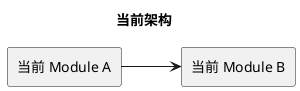

### 6.3 目标架构图

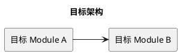

### 6.4 差距与演进路线

| 差距 | 当前 | 目标 | 演进步骤 | 风险 | Owner |
|---|---|---|---|---|---|
| <差距> | <现状> | <目标> | <步骤> | <风险> | <Owner> |

### 6.5 架构选项与取舍

| 选项 | 描述 | 目标适配 | 复杂度 | 风险 | 成本 | 可逆性 | 结论 |
|---|---|---|---|---|---|---|---|
| A | <方案> | 高 / 中 / 低 | 高 / 中 / 低 | <风险> | <成本> | <可逆性> | 采用 / 拒绝 |

- 采用：<选项>。
- 放弃什么：<代价>。
- 重开条件：<什么证据会改变决定>。
- ADR：<需要/不需要及原因>。

## 7. 系统架构视图（必填）

### 7.1 逻辑模型

#### 7.1.1 架构模式

<分层、管道、事件驱动、插件、客户端—服务端等；说明为什么适用。>

#### 7.1.2 分层逻辑模型

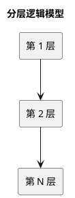

#### 7.1.3 Module 与职责

| Module | Interface | 深度/Leverage | 状态所有权 | 依赖 | 下位详细设计 |
|---|---|---|---|---|---|
| <Module> | <调用方必须知道什么> | <隐藏哪些复杂度> | <拥有/不拥有> | <依赖> | <DETAIL ID> |

#### 7.1.4 Seam 与 Adapter

| Seam | Interface | Adapter | 真实变化轴 | 失败语义 | 测试方式 |
|---|---|---|---|---|---|
| <位置> | <契约> | <两个或以上真实 Adapter> | <替换/故障/平台> | <错误> | <fake/contract test> |

### 7.2 技术模型

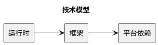

| 技术/平台 | 用途 | 采用/复用/扩展/退役 | 版本策略 | 替代方案 | 风险 |
|---|---|---|---|---|---|
| <技术> | <用途> | Build / Buy / Reuse / Extend / Decommission | <策略> | <候选> | <风险> |

### 7.3 数据模型

#### 7.3.1 数据架构模式

<数据分层、事件、索引、缓存、主从、读写分离等。>

#### 7.3.2 关键数据对象

| 数据对象 | Owner | 真源 | 读者 | 写者 | 一致性 | 生命周期 |
|---|---|---|---|---|---|---|
| <对象> | <Module/团队> | <位置> | <主体> | <主体> | 强 / 最终 / 其他 | <创建—更新—删除> |

#### 7.3.3 静态数据结构模型

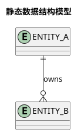

#### 7.3.4 数据流与所有权模型

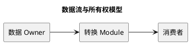

### 7.4 代码模型

#### 7.4.1 代码组织

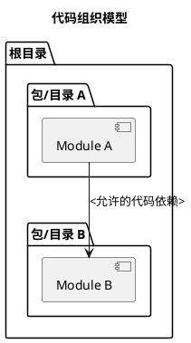

#### 7.4.2 代码元素清单

| 代码 Module | 路径 | Interface | Implementation | Owner | 依赖规则 |
|---|---|---|---|---|---|
| <Module> | <路径> | <Interface> | <Implementation 摘要> | <Owner> | <规则> |

### 7.5 构建模型

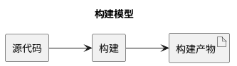

| 构建元素 | 输入 | 工具/环境 | 输出 | 缓存 | 验证 |
|---|---|---|---|---|---|
| <元素> | <输入> | <工具> | <产物> | <策略> | <检查> |

### 7.6 交付模型

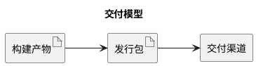

| 交付元素 | 格式 | 消费者 | 完整性/签名 | 版本 | 退役策略 |
|---|---|---|---|---|---|
| <元素> | <格式> | <消费者> | <规则> | <策略> | <策略> |

### 7.7 部署模型

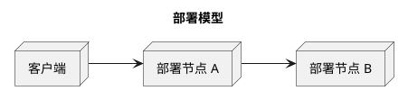

| 部署节点 | 规格 | 运行 Module | 网络/信任区 | 扩缩容 | 数据/密钥 |
|---|---|---|---|---|---|
| <节点> | <CPU/内存/存储/OS> | <Module> | <区域> | <规则> | <位置> |

### 7.8 运行模型

#### 7.8.1 并发与并行

| 运行流程 | 并发单位 | 并行点 | 顺序约束 | 背压/限流 | 取消 |
|---|---|---|---|---|---|
| <流程> | <请求/任务/租户> | <并行> | <约束> | <策略> | <传播> |

#### 7.8.2 运行交互

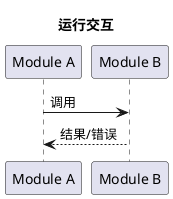

## 8. 关键技术方案（必填）

<!-- 每个关键方案复制以下结构。只保留跨 Module、跨数据所有权或影响关键质量属性的方案。 -->

### 8.1 <关键技术方案名称>

- 问题：<要解决什么>。
- 约束：<平台、质量、成本、兼容>。
- 候选：<至少一个真实备选>。
- 采用：<方案>。
- Module / Interface / Seam：<设计>。
- 数据与状态所有权：<Owner>。
- 失败与回退：<行为>。
- 验证：<最小有效验证>。
- ADR：<链接或不需要>。

## 9. AI/Agent 架构契约（条件必填）

### 9.1 模型、指令、工具、上下文与循环

| 构成 | 系统级设计 | Owner | 版本策略 | 失败边界 |
|---|---|---|---|---|
| 模型 | <模型能力与路由> | <Owner> | <版本> | <不可用/退化> |
| 指令 | <层级与覆盖规则> | <Owner> | <revision> | <冲突> |
| 工具 | <可见工具与执行 Owner> | <Owner> | <契约> | <错误/拒绝> |
| 上下文 | <来源、选择、预算、清理> | <Owner> | <schema> | <污染/超限> |
| 循环 | <继续、停止、移交> | <Owner> | <规则> | <失控/重复> |

### 9.2 控制权模型

| 能力 | 模型可决定 | 宿主强制 | 人工门 | 审计证据 |
|---|---|---|---|---|
| 读取数据 | <范围> | <身份/权限/过滤> | <条件> | <Trace/Receipt> |
| 调用工具 | <选择> | <沙箱/预算/allowlist> | <高风险动作> | <记录> |
| 修改状态 | <建议/执行> | <事务/幂等/回滚> | <确认> | <Receipt> |
| 结束任务 | <信号> | <超时/完成判据> | <条件> | <验证> |

### 9.3 不可信输入与上下文安全

- 不可信来源：<用户、网页、文件、工具结果、记忆等>。
- 权限不随文本提升：<宿主硬控制>。
- 信任/来源/时间标记：<设计>。
- Prompt Injection 防护：<隔离、验证、拒绝、监控>。

### 9.4 Eval 与回归架构

| Eval 层级 | 要证明什么 | 数据集 | Grader | 指标 | 发布门 | 产物 |
|---|---|---|---|---|---|---|
| Module / 回合 / 任务 / 安全 / 运行 | <声明> | <版本化数据> | 代码 / 模型 / 人工 / 混合 | <指标> | <门> | <Report/Receipt> |

## 10. 质量属性与威胁分析（必填）

### 10.1 关键资产清单

| 资产 | Owner | 分类 | 价值/损失 | 访问主体 | 保护目标 |
|---|---|---|---|---|---|
| <资产> | <Owner> | 公开 / 内部 / 敏感 / 密钥 / Safety-critical | <影响> | <主体> | C / I / A / Privacy / Safety |

### 10.2 暴露面与信任关系

| 暴露面 | 入口 | 信任级别 | 可达资产 | 现有控制 | 缺口 |
|---|---|---|---|---|---|
| <入口> | <协议/节点> | <级别> | <资产> | <控制> | <缺口> |

### 10.3 攻击与故障路径

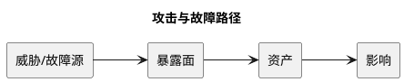

### 10.4 控制与剩余风险

| 威胁/故障 | 预防 | 检测 | 响应 | 恢复 | 验证 | 剩余风险 |
|---|---|---|---|---|---|---|
| <风险> | <控制> | <信号> | <动作> | <目标> | <测试/演练> | <接受/补强> |

### 10.5 Safety（条件必填）

- 危害：<对人、环境、财产或关键业务的危害>。
- 安全状态：<进入什么状态>。
- 人工控制与停止：<设计>。
- 验证与责任人：<证据>。

## 11. 容量、性能与可运维性（必填）

### 11.1 容量模型

| 维度 | 当前 | 目标平均 | 目标峰值 | 最坏情况 | 扩展点 | 验证 |
|---|---|---|---|---|---|---|
| 用户 / 请求 / 任务 / 数据 / 模型调用 / 存储 | <值> | <值> | <值> | <值> | <CPU/IO/配额等> | <压测> |

### 11.2 性能与成本预算

| 路径 | P50 | P95 | P99 | 吞吐 | 单位成本 | 超预算动作 |
|---|---|---|---|---|---|---|
| <路径> | <值> | <值> | <值> | <值> | <值> | <降级/限流> |

### 11.3 可观测性与审计

| 信号 | 目的 | 维度 | 阈值 | 告警对象 | 保留期 | 隐私处理 |
|---|---|---|---|---|---|---|
| 指标 / 日志 / Trace / Receipt | <目的> | <标签> | <阈值> | <Owner> | <期限> | <规则> |

- 健康定义：<成功、失败、部分成功>。
- 诊断路径：<从告警到根因>。
- 恢复目标：<RTO/RPO/MTTR>。
- Runbook：<链接或待建条件>。

## 12. 兼容、迁移、部署与回滚（必填）

### 12.1 兼容矩阵

| 消费者/依赖 | 当前契约 | 目标契约 | 兼容策略 | 退役日期 | Owner |
|---|---|---|---|---|---|
| <主体> | <契约> | <契约> | 向后兼容 / 双写 / Adapter / 破坏性 | <日期> | <Owner> |

### 12.2 架构演进阶段

| Phase | 架构变化 | 前置证据 | 验证 | 回滚点 | Owner |
|---|---|---|---|---|---|
| 0 | <变化> | <门> | <证据> | <恢复> | <Owner> |

### 12.3 发布与部署策略

- 配置门/Feature flag：<设计>。
- 灰度范围：<租户、流量、区域>。
- 数据迁移：<前向/后向兼容>。
- 回滚触发：<指标/事故>。
- 回滚时间目标：<值>。
- 不可逆步骤：<批准、备份、恢复证据>。

## 13. 架构验证（必填）

### 13.1 声明—证据矩阵

| 声明 ID | 架构声明 | 最小有效验证 | 通过标准 | 证据位置 | Owner |
|---|---|---|---|---|---|
| `AV-01` | <行为/质量属性> | 原型 / 契约测试 / 压测 / 安全测试 / 演练 / Eval | <标准> | <链接> | <Owner> |

### 13.2 验证层次

| 层次 | 覆盖范围 | 环境 | 数据 | 触发时机 | 失败动作 |
|---|---|---|---|---|---|
| Interface | 跨 Module 契约 | <环境> | <数据> | 每次相关变更 | 阻断 |
| 架构 | 依赖方向、数据所有权、部署拓扑 | <环境> | <数据> | 架构变更 | 阻断/修订 |
| 非功能 | 性能、安全、恢复、容量 | <环境> | <数据> | 发布候选 | 回滚/不批准 |
| AI Eval | 模型、上下文、工具和任务 | <环境> | <任务集> | 模型/策略变化 | 阻断相应 Gate |

### 13.3 证据状态

| 状态 | 含义 | 允许的声明 |
|---|---|---|
| `Planned` | 设计或验证计划存在 | 只能声明计划 |
| `Implemented` | 代码/配置/资产存在 | 只能声明已实现 |
| `Verified` | 指定环境的测试/Eval 达标 | 声明必须带环境和版本 |
| `Production` | 获批生产流量与 telemetry 支持 | 不能由本地/CI 代替 |

## 14. 风险、开放问题与 ADR（必填）

### 14.1 风险

| ID | 风险 | 概率 | 影响 | 缓解 | 触发信号 | Owner |
|---|---|---|---|---|---|---|
| `R-01` | <风险> | 高 / 中 / 低 | 高 / 中 / 低 | <动作> | <信号> | <Owner> |

### 14.2 开放问题

| ID | 问题 | 阻断点 | Owner | 决策日期 | 结果 |
|---|---|---|---|---|---|
| `Q-01` | <问题> | 批准 / 实现 / 发布 / 不阻断 | <Owner> | <日期> | <待定> |

### 14.3 ADR 清单

| 决定 | 难逆性/真实取舍 | 状态 | 链接 |
|---|---|---|---|
| <决定> | <原因> | Proposed / Accepted / Superseded | <ADR> |

### 14.4 实现偏差

| 偏差 | 获批架构 | 当前实现 | 原因 | 风险/后续 | 是否重新批准 |
|---|---|---|---|---|---|
| <偏差> | <设计> | <实现> | <原因> | <影响> | 是 / 否 |

## 15. 所有权、评审与批准（必填）

### 15.1 运行与维护所有权

| 事项 | Owner | 文档/工具 | 响应目标 |
|---|---|---|---|
| 日常运行 | <Owner> | <Runbook> | <目标> |
| 告警处理 | <Owner> | <告警/Runbook> | <目标> |
| 数据修复 | <Owner> | <工具/流程> | <目标> |
| 架构更新 | <Owner> | <本说明书/ADR> | 与变更同批 |

### 15.2 Architecture Review Gate

- [ ] 权威源文件为 UTF-8 Markdown；结构化字段使用 Markdown 表格；所有图使用 PlantUML，边界匹配且已验证可渲染。
- [ ] 已按 ISO/IEC/IEEE 42010:2022 对标剖面检查利益相关方—关注点—视角—视图—模型—架构决定映射。
- [ ] 已通过[统一完整性门](design-doc.md#13-完整性门)：必填项有实质内容，占位符清零，本地链接有效。
- [ ] Baseline 剖面包含跨 Module Interface、数据一致性、故障域、容量预算和下位设计责任分配的实现级补充。
- [ ] PRD 已批准，或架构 Spike 有明确范围和退出条件。
- [ ] 当前与目标架构、范围和非目标已分开。
- [ ] Module、Interface、Seam、Adapter 和状态所有权明确。
- [ ] 每个 Seam 有真实变化轴；没有假想 Adapter 层。
- [ ] 质量属性写成可测场景。
- [ ] 逻辑、技术、数据、代码、构建、交付、部署和运行视图齐全或明确不适用。
- [ ] 数据所有权、信任关系和依赖方向明确。
- [ ] 关键技术方案有备选、取舍、风险、验证和 ADR 判断。
- [ ] 安全、隐私、韧性、可靠、可用和 Safety 已分析。
- [ ] 容量、性能、成本、可观测性和恢复目标可测。
- [ ] 兼容、迁移、发布和回滚可执行。
- [ ] AI/Agent 架构区分模型决策、宿主硬控制和人工门。
- [ ] 架构声明有最小有效验证，证据状态未越级。
- [ ] 下位详细设计 Owner 和 Interface 归属明确。

### 15.3 批准记录

| 角色 | 姓名 | 结论 | 日期 | 条件/备注 |
|---|---|---|---|---|
| 产品 | <…> | Approve / Revise / Reject | <日期> | <…> |
| 架构 | <…> | Approve / Revise / Reject | <日期> | <…> |
| 实现 | <…> | Approve / Revise / Reject | <日期> | <…> |
| QA | <…> | Approve / Revise / Reject | <日期> | <…> |
| 运维 | <…> | Approve / Revise / Not applicable | <日期> | <…> |
| 安全/隐私 | <…> | Approve / Revise / Not applicable | <日期> | <…> |

## 16. 任职资格证据附录（条件必填）

<!-- 系统级架构通常重点映射 C1/C2/C5、K3/K4/K5/K6；不要在本文件重复单功能算法实现细节。 -->

### 16.1 架构证据矩阵

| 能力 ID | 本架构体现 | 设计证据 | 实现证据 | 验证证据 | 状态 | 个人贡献 |
|---|---|---|---|---|---|---|
| <K/S/C ID> | <规划、系统设计、数据、部署、质量属性> | <章节/ADR> | <代码/配置/构建> | <测试/压测/演练/Eval> | Planned / Implemented / Verified / Production | <可核验贡献> |

### 16.2 证据缺口

| 声明/能力 | 当前证据 | 缺口 | 补强产物 | 是否阻断 |
|---|---|---|---|---|
| <声明> | <证据> | <缺口> | <产物> | 是 / 否 |

## 17. 变更记录与参考依据（必填）

### 17.1 变更记录

| 版本 | 日期 | 变更 | 原因 | 是否重新批准 |
|---|---|---|---|---|
| `0.1` | <日期> | 初稿 | <原因> | 否 |

### 17.2 参考依据

- [ISO/IEC/IEEE 42010:2022：Architecture description](https://www.iso.org/standard/74393.html)
- [Google：Managing ML projects — Stakeholders and design documents](https://developers.google.com/machine-learning/managing-ml-projects/stakeholders)
- [Microsoft：Develop an architecture design specification](https://learn.microsoft.com/en-us/azure/well-architected/architect-role/architecture-design-specification)
- [Microsoft：Maintain an architecture decision record](https://learn.microsoft.com/en-us/azure/well-architected/architect-role/architecture-decision-record)
- [Microsoft：Create architecture design diagrams](https://learn.microsoft.com/en-us/azure/well-architected/architect-role/design-diagrams)
- [Anthropic：Building effective agents](https://www.anthropic.com/engineering/building-effective-agents)
- [Anthropic：Demystifying evals for AI agents](https://www.anthropic.com/engineering/demystifying-evals-for-ai-agents)
- [OpenAI：A practical guide to building AI agents](https://openai.com/business/guides-and-resources/a-practical-guide-to-building-ai-agents/)
- [Apple Human Interface Guidelines：Generative AI](https://developer.apple.com/design/human-interface-guidelines/generative-ai)
